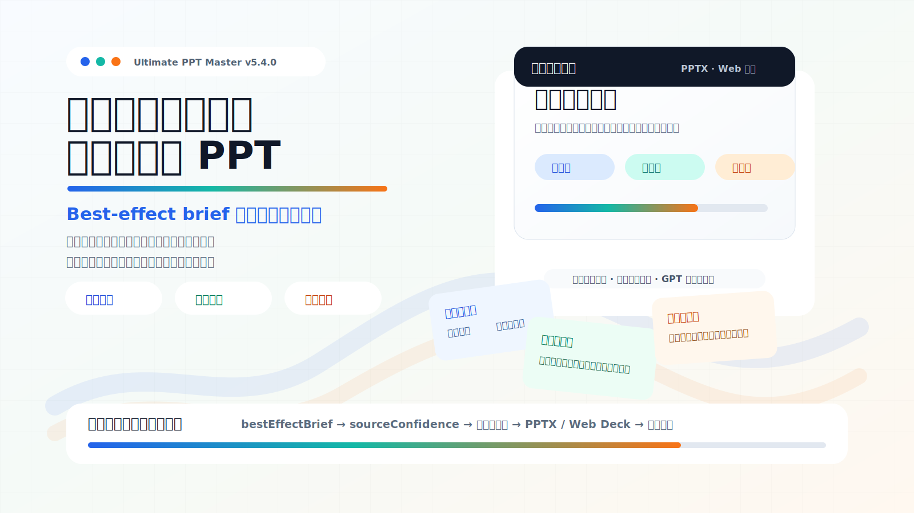
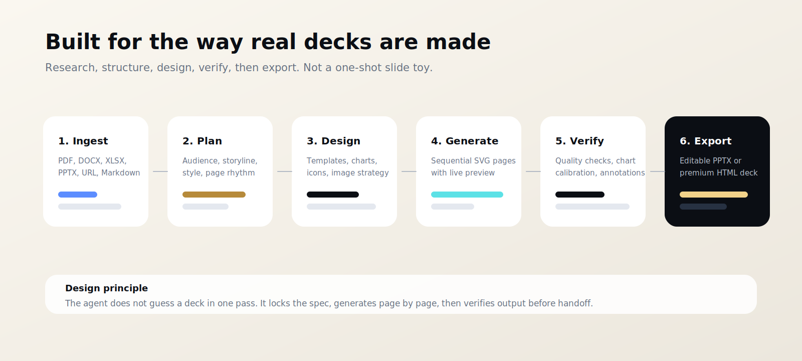
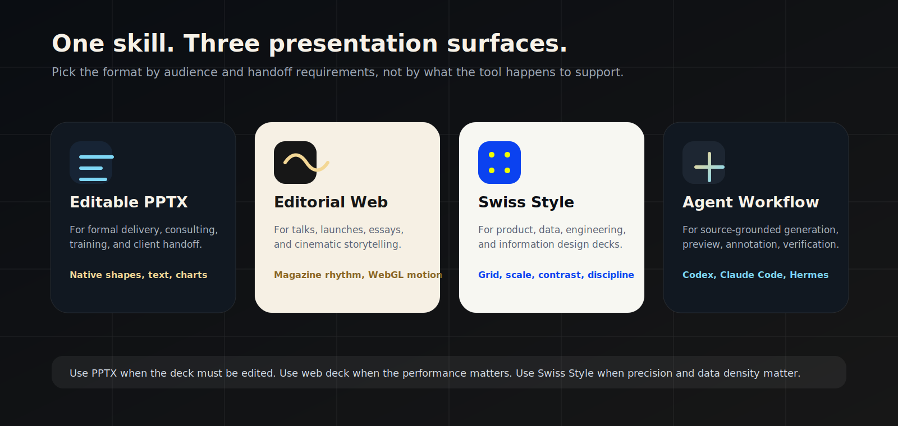

# Ultimate PPT Master

> From source documents to editable PowerPoint decks and cinematic web presentations.

<p align="center">
  <strong>v2.0.0</strong> · English · <a href="./README.zh-CN.md">中文 README</a>
</p>



<p align="center">
  <a href="https://github.com/kdnsna/ultimate-ppt-master-skill"></a>
  
  
  
  
  
</p>

Most AI presentation tools can make slides look plausible. The problem starts five minutes later: the deck is a screenshot, the layout is locked, the brand system is gone, and the user still has to rebuild the parts that matter.

Ultimate PPT Master is built for that moment. It is a portable agent skill for Codex, Claude Code, OpenClaw, Hermes, Cursor-style IDEs, and other coding agents. It turns real source material into two production-grade outputs:

- **Editable PowerPoint (`.pptx`)** with native text boxes, shapes, charts, speaker notes, animations, and optional narration.
- **Magazine-style web decks (`index.html`)** for launches, talks, internal sharing, demo days, and visual storytelling.

The goal is not "one prompt to random slides." The goal is a repeatable presentation workflow that respects source material, locks a design spec, generates page by page, previews visually, verifies output, and exports something people can actually use.

---

## What's New in v2.0.0

Version 2.0.0 is the fusion release: it syncs the latest upstream work from the two projects this package builds on, then adapts that work into one coherent agent workflow.

| Update | What changed |
|---|---|
| **Fresh upstream sync** | Synced `hugohe3/ppt-master` and `op7418/guizang-ppt-skill` implementation updates, while preserving this repository's cross-agent adaptation layer. |
| **Two-mode output chooser** | Generic "make a PPT" requests now route into either editable PowerPoint or magazine-style web deck generation before work begins. |
| **Expanded source handling** | Added stronger support for PDF, DOCX, XLSX, PPTX, URL, Markdown, and pasted-text workflows. |
| **Editable PPTX upgrades** | Brought in newer conversion, SVG-to-PPTX, quality-check, chart, template, animation, narration, and live-preview tooling. |
| **Magazine web deck upgrades** | Kept the original Editorial Magazine x E-ink style as the default, and added an optional Swiss Style engine for data, product, and engineering presentations. |
| **Image workflow expansion** | Added image search references, multi-provider image-generation guidance, prompt templates, palette references, rendering references, and layout patterns. |
| **README and growth package** | Rebuilt the GitHub homepage with product positioning, visual diagrams, bilingual entry points, and a clearer explanation of why the project is useful. |

See [UPSTREAM_SYNC.md](./UPSTREAM_SYNC.md) for the exact upstream baselines and adaptation policy.

---

## Why This Gets Stars

GitHub users tend to reward presentation tools that solve a real workflow problem, not just a pretty demo. Recent open-source presentation projects show the same demand pattern:

| What users want | Why it matters | How Ultimate PPT Master answers |
|---|---|---|
| **Editable output** | Teams must revise decks in PowerPoint after AI generation | Native PPTX export, not flattened slide screenshots |
| **Source-grounded generation** | Real decks start from reports, docs, spreadsheets, URLs, and old slides | PDF, DOCX, XLSX, PPTX, URL, Markdown, pasted text |
| **No SaaS lock-in** | Developers want control over files, models, and workflow | Local-first skill package; agent runs scripts on your machine |
| **Design quality** | A usable deck needs rhythm, hierarchy, whitespace, and a clear visual system | Strategy phase, spec lock, professional templates, chart library |
| **Iteration after generation** | First drafts need visual corrections | Live preview, annotations, quality checks, chart calibration |
| **Multiple presentation surfaces** | A client handoff and a keynote are different products | Editable PPTX plus editorial and Swiss Style web decks |

Reference landscape: [ppt-master](https://github.com/hugohe3/ppt-master), [Presenton](https://github.com/presenton/presenton), [Slidev](https://github.com/slidevjs/slidev), [Marp](https://github.com/marp-team/marp), [reveal.js](https://github.com/hakimel/reveal.js), and [banana-slides](https://github.com/Anionex/banana-slides) all point to the same market: people want faster presentation creation, but they still need control, editability, and taste.

---

## Two Engines, One Workflow



### 1. Editable PowerPoint Engine

Use this when the deck needs to be delivered, reviewed, or modified by other people.

- Real PowerPoint elements: text boxes, shapes, tables, charts, and media.
- Source conversion from PDF, DOCX, XLSX, PPTX, URL, Markdown, and pasted text.
- Strategy phase that locks audience, page count, style, color, typography, image policy, and page rhythm.
- Sequential SVG authoring with `spec_lock.md` re-read before each page.
- Live browser preview with element-level annotations.
- Quality checker before export.
- Optional transitions, per-element animations, speaker notes, recorded narration, and chart coordinate verification.

### 2. Magazine Web Deck Engine

Use this when the presentation itself is the experience: demo day, keynote, private sharing, product launch, industry talk, or a visually memorable internal readout.

- Single-file `index.html` deck.
- Horizontal navigation with keyboard, wheel, and touch support.
- WebGL visual runtime and local motion fallback.
- Style A: **Editorial Magazine x E-ink** for narrative, culture, industry, and human-centered talks.
- Style B: **Swiss Style** for product, engineering, data, system diagrams, and information design.
- Built-in screenshot framing, image prompt references, theme rules, layout skeletons, and QA checklist.



---

## What Makes It Different

| Category | Typical result | Ultimate PPT Master |
|---|---|---|
| Image-based AI slide tools | Pretty but hard to edit | Native editable PPTX path |
| Template-only generators | Fast but rigid | Free design plus reusable template workflows |
| Markdown slide tools | Great for developers, less natural for business handoff | PPTX for handoff, HTML for performance |
| SaaS presentation tools | Convenient but locked into a platform | Local-first scripts and portable skill files |
| One-shot prompt generators | Fast first draft, weak control | Strategy, spec lock, live preview, verification |

This project combines the proven editable PPTX workflow of [Hugo He's ppt-master](https://github.com/hugohe3/ppt-master) with the polished HTML deck aesthetics of [op7418's guizang-ppt-skill](https://github.com/op7418/guizang-ppt-skill), then wraps them into a cross-agent package that is easier to install, reuse, and extend.

---

## Visual Directions Included

Ultimate PPT Master is opinionated about taste. It tries to protect the deck from the two common AI failure modes: random decoration and monotonous corporate templates.

| Direction | Best for | Design language |
|---|---|---|
| **Consulting / executive PPTX** | board updates, strategy, business analysis | clean hierarchy, action titles, charts, restrained color |
| **Academic / institutional PPTX** | defense, research, technical teaching | clear sections, formal typography, evidence-first structure |
| **Data and AI ops PPTX** | architecture, metrics, systems, workflows | dense but organized charts, diagrams, grids |
| **Editorial web deck** | talks, product stories, industry essays | serif headlines, e-ink texture, magazine rhythm |
| **Swiss web deck** | product launches, engineering, data reports | modular grid, sharp contrast, Helvetica-like discipline |

---

## Quick Start

### 1. Install

```bash
git clone https://github.com/kdnsna/ultimate-ppt-master-skill.git ~/.codex/skills/ultimate-ppt-master
cd ~/.codex/skills/ultimate-ppt-master
python3.10 -m venv .venv
.venv/bin/python -m pip install --upgrade pip
.venv/bin/python -m pip install -r requirements.txt
```

For robust PPTX compatibility on macOS, install Cairo:

```bash
brew install cairo pkg-config
```

Node.js is only needed for Swiss Style web deck validation:

```bash
node scripts/validate-swiss-deck.mjs path/to/index.html
```

### 2. Ask Your Agent

```text
Use $ultimate-ppt-master to turn reports/q3-review.pdf into a 12-slide editable PPTX for an executive meeting.
```

```text
使用 $ultimate-ppt-master 把这个 Markdown 做成一份杂志风网页 PPT，用于 20 分钟线下分享。
```

```text
Use $ultimate-ppt-master to create a Swiss Style web deck from this product launch outline.
```

For generic requests like "make a PPT", the skill first asks you to choose:

1. **Editable PowerPoint (`.pptx`)** for formal reports, consulting decks, training, and handoff.
2. **Magazine Web Deck (`index.html`)** for talks, launches, demo days, and highly visual presentations.

---

## Supported Inputs and Outputs

| Input | Editable PPTX | Web Deck |
|---|---:|---:|
| PDF | yes | use converted Markdown |
| DOCX / Word | yes | use converted Markdown |
| XLSX / Excel | yes | use converted Markdown |
| Existing PPTX | yes | use converted Markdown / template reference |
| URL / web page | yes | use converted Markdown |
| Markdown | yes | yes |
| Pasted notes or outline | yes | yes |

| Output | Use when | Notes |
|---|---|---|
| `.pptx` | business handoff, formal reporting, client review | native PowerPoint elements where supported |
| `.pptx` with animations | presenter-paced or self-running deck | transitions and object entrance effects |
| `.pptx` with narration | video export or asynchronous delivery | generated from speaker notes |
| `index.html` | keynote, demo day, visual storytelling | single-file web deck |

---

## Repository Map

| Path | Purpose |
|---|---|
| `README.zh-CN.md` | Optional Chinese README for Chinese users |
| `SKILL.md` | Main workflow entry for Codex and compatible agents |
| `AGENTS.md` | Portable entry for agentic coding tools |
| `CLAUDE.md` | Claude Code entry |
| `PROMPT.md` | Copy-paste prompt for tools without native skill directories |
| `scripts/` | Source conversion, project setup, preview, validation, PPTX export, image/audio helpers |
| `templates/` | PPTX layout templates, chart templates, icon library, spec references |
| `assets/magazine-web/` | Editorial and Swiss HTML deck templates, motion runtime, screenshot backgrounds |
| `references/` | Strategy, execution, image generation, shared standards, magazine web references |
| `workflows/` | Optional workflows: create template, live preview, chart verification, animation, narration |
| `UPSTREAM_SYNC.md` | Current upstream baseline and fusion adaptation policy |

---

## Built On Proven Open Source

Ultimate PPT Master is a fusion package built on two MIT-licensed foundations:

- [ppt-master](https://github.com/hugohe3/ppt-master) by Hugo He: editable PPTX workflow, SVG-to-PPTX export, templates, charts, role references, live preview, animation, narration, and quality tooling.
- [guizang-ppt-skill](https://github.com/op7418/guizang-ppt-skill) by op7418: magazine-style HTML deck workflow, editorial and Swiss templates, themes, layouts, screenshot treatment, and web deck QA.

This repository keeps the upstream copyright and license notices in [THIRD_PARTY_NOTICES.md](./THIRD_PARTY_NOTICES.md) and records sync baselines in [UPSTREAM_SYNC.md](./UPSTREAM_SYNC.md).

---

## 中文简介

终极融合PPT大师是一个跨 Agent 的演示文稿生成技能包。它不是简单的“一句话生成 PPT”，而是把真实材料转成可交付演示文稿的完整工作流。

它支持两种输出：

1. **可编辑 PowerPoint (`.pptx`)**
   适合正式汇报、咨询报告、培训课件、客户交付和需要继续修改的材料。重点是可编辑、可验证、可交付。

2. **杂志风网页 PPT (`index.html`)**
   适合线下分享、发布会、demo day、个人演讲和强视觉展示。默认是“电子杂志 × 电子墨水”风格，也可以选择“瑞士国际主义 / Swiss Style”信息设计风格。

为什么值得用：

- 支持 PDF、DOCX、XLSX、PPTX、URL、Markdown 和直接粘贴文本。
- 先做策略和设计锁定，再逐页生成，避免 AI 随机发挥。
- PPTX 路线输出真实 PowerPoint 元素，不是整页截图。
- Web 路线输出单文件 HTML，适合演讲和传播。
- 本地优先，适配 Codex、Claude Code、OpenClaw、Hermes、Cursor 类 IDE 和通用 Agent 工具。

快速安装：

```bash
git clone https://github.com/kdnsna/ultimate-ppt-master-skill.git ~/.codex/skills/ultimate-ppt-master
cd ~/.codex/skills/ultimate-ppt-master
python3.10 -m venv .venv
.venv/bin/python -m pip install -r requirements.txt
```

然后在 Codex 里说：

```text
使用 $ultimate-ppt-master 帮我把 reports/q3-review.pdf 做成 12 页可编辑 PPTX。
```

或者：

```text
使用 $ultimate-ppt-master 做一份 Swiss Style 网页 PPT，用于产品发布演讲。
```

---

## License

MIT. See [LICENSE](./LICENSE) and [THIRD_PARTY_NOTICES.md](./THIRD_PARTY_NOTICES.md).
