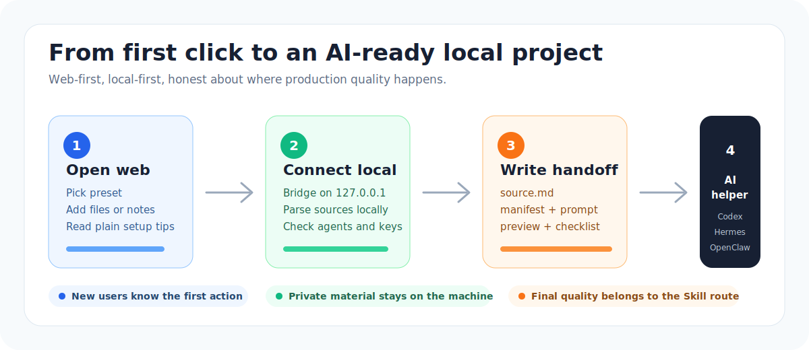
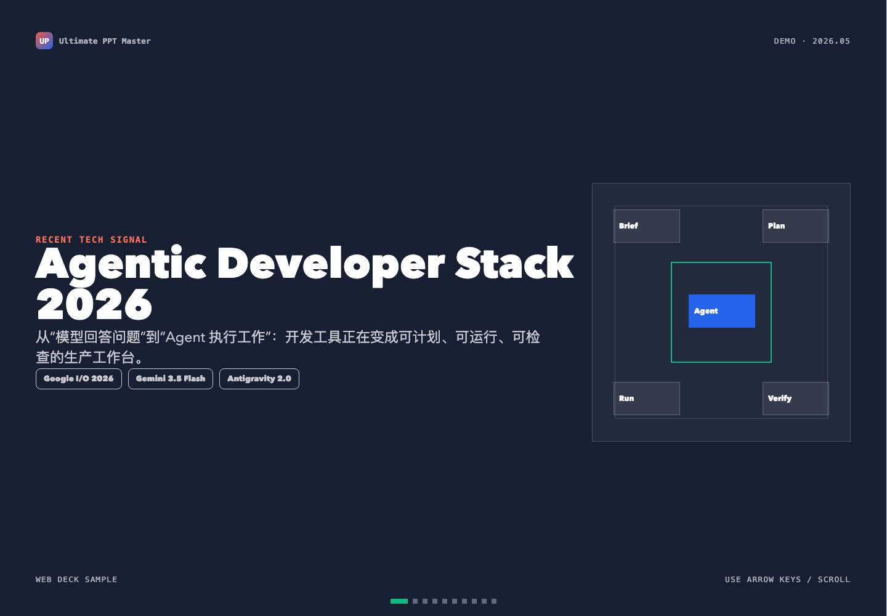
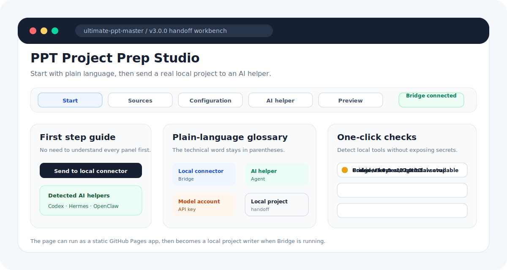
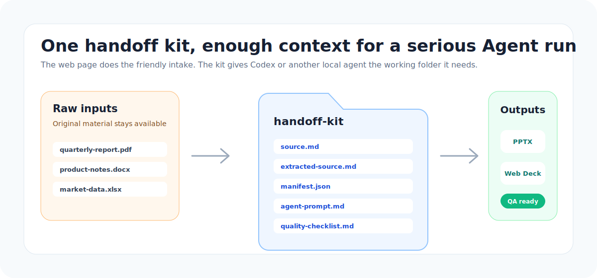
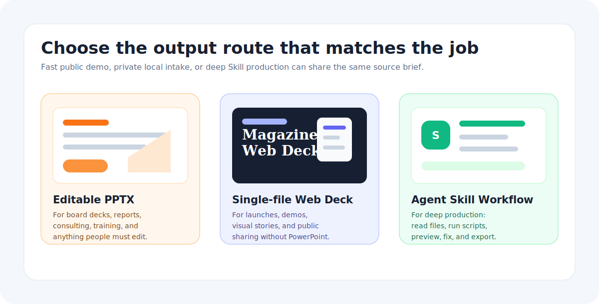

# Ultimate PPT Master

> Turn PDFs, Word docs, PPTX decks, spreadsheets, URLs, and rough notes into Agent-ready presentation projects, then produce editable PowerPoint decks or magazine-style Web Decks locally.

<p align="center">
  <strong>v2.4.0</strong> · English · <a href="./README.zh-CN.md">中文 README</a> · <a href="./docs">Docs</a> · <a href="./docs/agent-connect-bridge.md">Agent Bridge</a> · <a href="./docs/agent-setup.md">Agent Skill</a>
</p>


<p align="center">
  <a href="https://kdnsna.github.io/ultimate-ppt-master-skill/"><strong>Open Web Experience</strong></a>
  ·
  <a href="#use-it-in-three-moves"><strong>3-Step Quickstart</strong></a>
  ·
  <a href="#use-as-agent-skill"><strong>Use as Agent Skill</strong></a>
  ·
  <a href="#desktop-later"><strong>Desktop Later</strong></a>
</p>

<p align="center">
  
  
  
  
  
  
</p>

## Use It In Three Moves

| Step | What you do | What you get |
|---|---|---|
| **1. Open the Web Experience** | Visit [the static web page](https://kdnsna.github.io/ultimate-ppt-master-skill/), pick a preset, and write or paste the deck goal. | A readable brief, preview, source template, and plain-language setup guide. |
| **2. Connect this computer** | Run `npm run bridge` from a local clone when you want real file parsing and local project output. | The local connector (Bridge) detects Codex / Hermes / OpenClaw / Claude Code and keeps files on `127.0.0.1`. |
| **3. Send it to an AI helper** | Click **Send to local connector**, then copy or launch the generated command. | A local project folder with source files, manifest, agent prompt, preview, and quality checklist. |

```bash
git clone https://github.com/kdnsna/ultimate-ppt-master-skill.git
cd ultimate-ppt-master-skill
npm run setup
npm run bridge
```

Then open the web page and click **Send to local connector**.

## What It Is

Ultimate PPT Master is a **local-first AI presentation hub**. It gives non-technical users a friendly web page, then gives power users a real local handoff folder that Codex, Claude Code, Hermes, OpenClaw, or another agent can continue from.

It is designed as a practical fusion layer around two strong routes:

- the editable PPTX route inspired by Hugo He's PPT Master direction;
- the high-impact single-file Web Deck route inspired by op7418 / Guizang-style presentation skills.

The goal is simple: **the web page should make the workflow easy to understand; the local Skill should keep the production quality high.**



## v2.4.0 Release Focus

v2.4.0 turns the recent Web + Bridge work into a more reusable production system: **GitHub-informed direction, stronger preset packs, and release gates for reusable deck starters.**

This release improves the Web Experience and Skill package in the places that help other people reuse it:

- a GitHub technology scan maps current signals such as MarkItDown, MCP servers, Slidev, Marp, PptxGenJS, DOM-to-PPTX, and open AI presentation products to concrete product decisions;
- Consulting Proposal and Tech Trend Web Deck now join Executive Business Review and Product Pitch as reusable preset starter packs;
- each starter pack has a machine-readable `preset.json`, sanitized `source.md`, and `quality-checklist.md`;
- `scripts/audit_preset_packs.py` verifies preset-pack contracts before release and now runs in CI;
- the Web Experience exposes the new pack paths and richer quality checks so handoff prompts are more specific;
- Bridge / handoff kits still preserve `manifest`, `engine-plan`, and `quality-checklist` so the Agent has a clear acceptance contract.

### v2.4.0 In Plain Words

- You no longer start from a blank prompt. Pick a starter pack and the project tells the Agent what material to ask for, which story shape to use, which templates fit, and what to check.
- The new GitHub scan explains why the project cares about Markdown handoff, local agents, editable PPTX, and web decks. It is the reasoning behind the release, not vague trend-chasing.
- Every starter pack now has a small public proof: a source skeleton, a web preview, a cover image, and a checklist. That makes the output direction easier to understand before anyone runs the full workflow.
- Maintainers get a simple audit command, `npm run audit:presets`, so reusable packs cannot silently lose required files.

## Next Direction

v2.4.0 ships a stronger **preset-pack reuse layer** on top of the Bridge + Skill setup path. The next direction is to add production-grade sample decks, screenshot sets, and benchmark runs for each pack before calling them stable.

Read the plan: [Next Roadmap - Content and Template Presets](./docs/next-roadmap.md). Read the scan: [GitHub Technology Scan - May 2026](./docs/github-tech-scan-2026-05.md). Preset catalog: [templates/presets](./templates/presets).

## Why Not Just Use Codex To Install A Skill?

You can. For expert users, direct Skill install is still the fastest path.

Ultimate PPT Master exists for the moment before that: when the user has files, a rough goal, uncertain model setup, and no clear idea whether the job should become editable PPTX, a Web Deck, or both.

The product adds value by:

- turning a vague request into a structured brief;
- packaging real source files into a local handoff folder;
- showing Bridge, Agent, and provider readiness before production;
- generating an engine plan and quality checklist;
- preserving the original upstream quality routes instead of replacing them with a weaker web-only generator.

Read the deeper positioning note: [Product Positioning](./docs/product-positioning.md).

## One-Line Updates

This project is moving quickly. If you already installed it, update before producing serious client or team-facing material.

Update a local clone:

```bash
cd ultimate-ppt-master-skill
npm run update
```

Update the Codex Skill install:

```bash
bash -lc 'set -e; dir="$HOME/.codex/skills/ultimate-ppt-master"; if [ -d "$dir/.git" ]; then git -C "$dir" pull --ff-only; else git clone https://github.com/kdnsna/ultimate-ppt-master-skill.git "$dir"; fi; cd "$dir"; npm run setup'
```

Update a generic Agent Skill install:

```bash
bash -lc 'set -e; dir="$HOME/agent-skills/ultimate-ppt-master"; if [ -d "$dir/.git" ]; then git -C "$dir" pull --ff-only; else mkdir -p "$HOME/agent-skills"; git clone https://github.com/kdnsna/ultimate-ppt-master-skill.git "$dir"; fi; cd "$dir"; npm run setup'
```

Or ask Codex:

```text
Update ~/.codex/skills/ultimate-ppt-master to the latest GitHub version, run npm run setup, then use the README demo to confirm it works.
```

## Input To Output Demo



This public sample shows what users should provide and what they get back:

| What you provide | What it produces |
|---|---|
| A sanitized `source.md` with topic, public references, narrative, slide outline, and constraints. | A self-contained Web Deck plus a handoff structure that a local Agent can continue into PPTX / Web Deck production. |
| A clear Agent prompt with audience, output route, and quality requirements. | Reproducible production files such as `agent-prompt.md`, `engine-plan.md`, and `quality-checklist.md`. |

Input material excerpt:

```text
Topic: Agentic Developer Stack 2026
Goal: use a non-sensitive tech trend to explain why the web page is the front door and the Skill is the production engine.
Sources: Google I/O 2026 developer highlights, Google Developers Blog, and public technology coverage.
Output: an 11-slide magazine-style Web Deck, with a handoff path ready for editable PPTX production.
```

Example Agent prompt:

```text
Use $ultimate-ppt-master with examples/agentic-developer-tools-2026/source.sanitized.md.
Create a polished magazine-style Web Deck for GitHub Pages and keep the handoff ready for an editable PPTX route.
Verify layout, mobile readability, source references, and final exported files before delivery.
```

Open the full sample:

- [Input material: source.sanitized.md](./examples/agentic-developer-tools-2026/source.sanitized.md)
- [Generated Web Deck](https://kdnsna.github.io/ultimate-ppt-master-skill/examples/agentic-developer-tools-2026/web-demo.html)
- [Example notes](./examples/agentic-developer-tools-2026)

## Web Experience



The Web Experience is the public front door. It can run from GitHub Pages without a backend, account, model host, or API key storage.

It helps users:

- import `.md`, `.txt`, `.pdf`, `.docx`, `.pptx`, `.xlsx`, URLs, or pasted text;
- choose scenario, audience, output route, style, language, target agent, and model preference;
- see whether each source is browser-readable, locally parsed, or preserved as an attachment;
- generate an Agent handoff prompt and download a `source.md` template;
- preview a rough `preview-web-deck.html`;
- download `handoff-kit.zip` when Bridge is offline;
- send the same project to the local Bridge when Bridge is online;
- jump directly to Skill installation instructions.

Open it here:

```text
https://kdnsna.github.io/ultimate-ppt-master-skill/
```

For local web development:

```bash
npm --prefix apps/web install
npm run dev:web
```

Build the GitHub Pages artifact:

```bash
npm run build:web
```

## Connect Local Agent

Bridge turns the static web page into a local production console.

```bash
git clone https://github.com/kdnsna/ultimate-ppt-master-skill.git
cd ultimate-ppt-master-skill
npm run setup
npm run bridge
```

Bridge writes handoff projects under:

```text
~/UltimatePPTMaster/handoffs/
```

Safety defaults:

- binds only to `127.0.0.1`;
- reads provider config from environment variables, repo `.env`, or `~/.ppt-master/.env`;
- returns provider readiness and model names, never API key values;
- parses source files locally through `scripts/source_to_md/*`;
- does not launch an Agent unless you explicitly opt in.

Optional advanced launch mode:

```bash
npm run bridge -- --allow-launch
```

Full guide: [Agent Connect Bridge](./docs/agent-connect-bridge.md).

## Handoff Kit



Every handoff project is meant to be understandable by both humans and agents:

- `source.md`: clean fallback source;
- `extracted-source.md`: locally parsed source text when available;
- `attachments/`: original files preserved for the Agent;
- `manifest.json`: parse status, source metadata, and suggested commands;
- `agent-prompt.md`: ready-to-copy Agent prompt;
- `project-brief.json`: structured scenario, audience, style, and output settings;
- `engine-plan.md`: PPTX / Web Deck production plan;
- `quality-checklist.md`: review checklist before final delivery;
- `preview-web-deck.html`: browser-local rough preview;
- `README.md`: handoff folder instructions.

## Use as Agent Skill

Use the Skill route when quality matters more than the fastest first click. This is the route for Codex, Claude Code, Hermes, OpenClaw, Cursor-style IDEs, and other local agents that can read files and run scripts.

### Codex

```bash
git clone https://github.com/kdnsna/ultimate-ppt-master-skill.git ~/.codex/skills/ultimate-ppt-master
cd ~/.codex/skills/ultimate-ppt-master
npm run setup
```

Ask:

```text
Use $ultimate-ppt-master to turn reports/q3-review.pdf into a 12-slide editable PPTX for an executive meeting. Verify the deck before delivery.
```

### Claude Code, Hermes, OpenClaw, And Generic Agents

```bash
mkdir -p ~/agent-skills
git clone https://github.com/kdnsna/ultimate-ppt-master-skill.git ~/agent-skills/ultimate-ppt-master
cd ~/agent-skills/ultimate-ppt-master
npm run setup
```

Agent prompt:

```text
Read ~/agent-skills/ultimate-ppt-master/AGENTS.md and follow SKILL.md.
Use that repository path as SKILL_DIR.
Turn the provided source material into an editable PPTX and preview the result before delivery.
```

Full guide: [Agent Setup](./docs/agent-setup.md).

## Output Gallery



| Output | Best for | Production route |
|---|---|---|
| **Editable PowerPoint (`.pptx`)** | Business reports, consulting proposals, training decks, investor updates, and review-heavy work. | Agent Skill with local files, scripts, preview, repair, and export checks. |
| **Magazine Web Deck (`index.html`)** | Launches, demo days, product stories, keynotes, and visually rich sharing. | Web Experience preview first, then Skill for final polish and QA. |
| **Agent Handoff Project** | Users who already have Codex, Claude Code, Hermes, OpenClaw, Cursor, Cline, Roo, or Windsurf. | Bridge-generated folder or `handoff-kit.zip`. |

Public sanitized demos:

- [Executive Business Review Starter](./examples/executive-business-review-starter)
- [Consulting Proposal Starter](./examples/consulting-proposal-starter)
- [Product Pitch Starter](./examples/product-pitch-starter)
- [Tech Trend Web Deck Starter](./examples/tech-trend-web-deck-starter)
- [Agentic Developer Stack 2026](./examples/agentic-developer-tools-2026)
- [Desktop Cultural Tourism Demo](./examples/desktop-cultural-tourism-demo)

## Pick Your Path

| Path | Use it when | Start |
|---|---|---|
| **Open Web Experience** | You want the fastest way to understand the project and build a prompt. | [Open Web Experience](https://kdnsna.github.io/ultimate-ppt-master-skill/) |
| **Web + Bridge** | You want real file intake without uploading source material to a hosted service. | Run `npm run bridge`, then send from the web page. |
| **Agent Skill** | You already work inside Codex, Claude Code, Hermes, OpenClaw, Cursor, Cline, Roo, or Windsurf. | [Agent Setup](./docs/agent-setup.md) |
| **Web + Skill** | Recommended production flow: prepare the handoff kit visually, then let the agent finish it locally. | Use Web Experience, then Bridge or `handoff-kit.zip`. |
| **Desktop Later** | You want advanced local preview or future signed desktop packaging. | [Quickstart Desktop](./docs/quickstart-desktop.md) |

## Desktop Later

The Tauri desktop app remains in [apps/desktop](./apps/desktop), but it is no longer the first promotion path. Signing, notarization, Homebrew distribution, and native packaging are now release-maintenance work.

Developer preview:

```bash
git clone https://github.com/kdnsna/ultimate-ppt-master-skill.git
cd ultimate-ppt-master-skill
npm run setup
npm run desktop
```

Maintenance references:

- [Quickstart Desktop](./docs/quickstart-desktop.md)
- [Homebrew Distribution Plan](./docs/homebrew-distribution.md)
- [Release and Maintenance](./docs/release-maintenance.md)

## Documentation

| Need | Guide |
|---|---|
| Use the static online front door | [Web Experience](./docs/web-experience.md) |
| Connect the web page to local files and Agents | [Agent Connect Bridge](./docs/agent-connect-bridge.md) |
| Install and invoke the Skill | [Agent Setup](./docs/agent-setup.md) |
| Pick Web vs Skill vs Desktop Later | [Choosing a Workflow](./docs/choosing-a-workflow.md) |
| Configure provider keys locally | [Model and Provider Setup](./docs/model-provider-setup.md) |
| Understand why this exists beside direct Skill install | [Product Positioning](./docs/product-positioning.md) |
| See the next content/template direction | [Next Roadmap - Content and Template Presets](./docs/next-roadmap.md) |
| Review v2.4.0 release focus | [Release Notes - v2.4.0](./docs/release-notes-v2.4.0.md) |
| Review GitHub technology signals | [GitHub Technology Scan - May 2026](./docs/github-tech-scan-2026-05.md) |
| Review the local upstream benchmark | [Upstream Benchmark - May 2026](./docs/upstream-benchmark-2026-05.md) |
| Debug setup, extraction, output, provider, Tauri, or agent loading issues | [Troubleshooting](./docs/troubleshooting.md) |
| Release, Pages, Homebrew, signing, privacy, and maintenance | [Release and Maintenance](./docs/release-maintenance.md) |

## v2.4.0 Highlights

- Added a GitHub technology scan that links current open-source signals to project decisions.
- Promoted Consulting Proposal and Tech Trend Web Deck into reusable starter packs.
- Added visible starter proofs for Executive Business Review, Consulting Proposal, Product Pitch, and Tech Trend Web Deck.
- Added a preset-pack audit script and wired it into CI.
- Kept one-click local setup checks and agent selection across Codex, Hermes, OpenClaw, and Claude Code.
- Kept Bridge / handoff kit focused on local source staging, provider readiness, Agent commands, previews, and quality checks.
- Kept the Skill as the high-quality production route for final PPTX / Web Deck generation, preview, and repair.

See [UPSTREAM_SYNC.md](./UPSTREAM_SYNC.md) for upstream baselines and adaptation policy.

## Repo About

AI presentation hub: source files in, local Agent handoff out, editable PPTX and magazine Web Decks delivered.<br>
AI 演示生产中枢：资料进来，本地 Agent 接手，输出可编辑 PPTX / 杂志风网页演示。

## License

MIT. See [LICENSE](./LICENSE).
