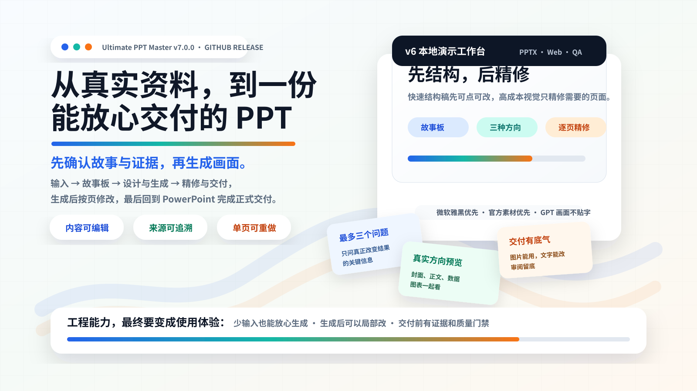
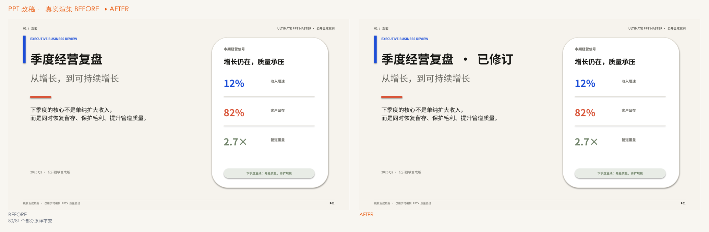
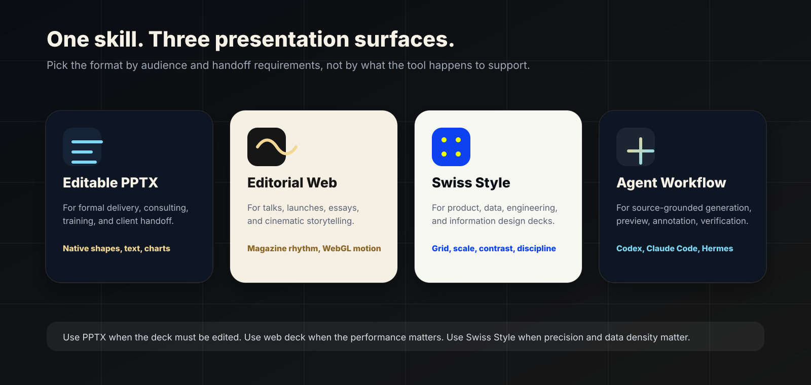
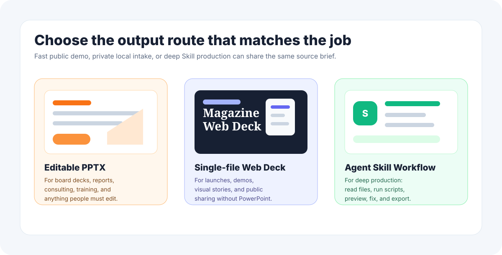

<p align="center">
  
</p>

<h1 align="center">Ultimate PPT Master</h1>

<p align="center">
  <strong>编辑的克制，生成的锋利。</strong><br>
  一套本地优先的演示文稿工作台：对已有 PPTX 做外科手术级保真编辑，<br>
  或从原始素材生成具有编辑智性的可编辑幻灯片与杂志风 Web Deck。
</p>

<br>

<p align="center">
  <a href="./README.en.md"><strong>English</strong></a>&ensp;·&ensp;<a href="https://kdnsna.github.io/ultimate-ppt-master-skill/"><strong>在线工作台</strong></a>&ensp;·&ensp;<a href="https://kdnsna.github.io/ultimate-ppt-master-skill/benchmark/"><strong>作品集</strong></a>&ensp;·&ensp;<a href="./docs/zh-CN/README.md"><strong>文档</strong></a>
</p>

<p align="center">
  <a href="https://github.com/kdnsna/ultimate-ppt-master-skill/stargazers"></a>&ensp;
  <a href="./LICENSE"></a>&ensp;
  <a href="https://github.com/kdnsna/ultimate-ppt-master-skill/releases/tag/v6.3.9"></a>&ensp;
  &ensp;
  
</p>

<br>

---

<br>

## 设计哲学

> *"内容决定节奏，装饰不能代替论据。"*

Ultimate PPT Master 不是又一个「输入主题、输出模板」的幻灯片生成器。它被设计为一间 **编辑工作室**——像杂志主编审稿一样对待每一页幻灯片：构图有据可查，色彩承担结构角色，留白即是节奏。

它解决两个问题，各有各的锋利：

<br>

<table>
<tr>
<td width="50%" valign="top">

### &ensp;&#9698;&ensp;保真编辑

**你已经有一份带品牌的 PPTX。**

领导发来的、客户给的、模板套好的真实文件——你只需要改几处数字或结论，却不能把母版、logo、印章和超链接一起弄坏。

Ultimate PPT Master 把 `.pptx` 当作 zip 包：**没点名的 part 原样拷贝，只重写你指定的页。** 改完交回一份 fidelity report，写明改了什么、多少部分原样没动。

```
改了 3 处 · 封面 / 第 4 页 / 第 6 页
其余 78 个部件原样保留
```

</td>
<td width="50%" valign="top">

### &ensp;&#9700;&ensp;从零生成

**你还没有 PPT，只有散落的素材。**

PDF、Word、Excel、网页、粘贴文字——先确认故事板和证据链，再选择视觉方向，逐页生成，最终交付：

- **可编辑 PPTX** — 正式汇报、咨询方案、政务材料
- **杂志风 Web Deck** — 发布会、路演、Demo Day

每一页都经过 brief 增强、证据定级、视觉审查，不是模板填空。

</td>
</tr>
</table>

<br>



<p align="center"><sub>真实样例：仅修改第 1 页标题。可复现 — <code>python3 scripts/make_preserve_demo_proof.py</code></sub></p>

<br>

---

<br>

## 快速开始

<details open>
<summary><strong>Agent 技能</strong>（推荐）</summary>

<br>

```bash
npx skills add kdnsna/ultimate-ppt-master-skill --skill ultimate-ppt-master
```

然后对你的 Agent 说：

> *把这份 PPT 第 3 页的「Q2」改成「Q3」，第 6 页结论换成附件新数字，别的都别动。*

> *用这份材料做一份 10 页可编辑 PPTX，正式汇报风格。*

</details>

<details>
<summary><strong>命令行</strong>（零第三方依赖）</summary>

<br>

```bash
# 查看每页内容
python3 scripts/preserve_edit_pptx.py --list deck.pptx

# 改一页文字
python3 scripts/preserve_edit_pptx.py deck.pptx out.pptx \
  --slide 1 --replace "Q2=Q3" --report fidelity.json

# 样式 / 表格 / 图表 typed ops
python3 scripts/preserve_edit_pptx.py deck.pptx out.pptx \
  --slide 2 --op '{"op":"style_text","size":24,"bold":true}'

# 多页批量编辑
python3 scripts/preserve_edit_pptx.py deck.pptx out.pptx --edits edits.json
```

`edits.json` 示例：

```json
[
  { "slide": 1, "replacements": { "Q2": "Q3" } },
  { "slide": 4, "operations": [
      { "op": "replace_table_cell", "row": 2, "col": 1, "text": "128" }
  ]},
  { "slide": 6, "operations": [
      { "op": "set_chart_value", "series": 1, "point": 2, "value": 42 }
  ]}
]
```

</details>

<details>
<summary><strong>桌面端</strong></summary>

<br>

```bash
git clone https://github.com/kdnsna/ultimate-ppt-master-skill.git
cd ultimate-ppt-master-skill
npm run setup && npm run desktop
```

拖入 `.pptx` → 选页 → 编辑 → 保存。原文件永不覆盖。

</details>

<details>
<summary><strong>MCP Server</strong>（接入任意 Agent）</summary>

<br>

```bash
python3 scripts/ppt_preserve_mcp.py
```

零依赖 stdio MCP，暴露 `inspect_pptx` / `edit_pptx_preserving` 两个工具。详见 [MCP 接入指南](./docs/zh-CN/guides/mcp-server.md)。

</details>

<br>

---

<br>

## 编辑能力

| 操作 | 说明 |
|:---|:---|
| **文本** | 标题、正文、标注 — 查找替换 |
| **样式** | 字体 / 字号 / 粗体 / 颜色，可按文本定位 |
| **表格** | 按行列坐标或内容查找改单元格 |
| **形状** | 移动、缩放（单位 pt） |
| **图表** | 图例 / 标签文字、数据点数值 |
| **保真门禁** | 改动清单 + 意外变更即失败，绝不交付损坏文件 |

<sub>暂不支持：增删整页、插入新图、重建表格结构、自由画布重排 — 这些请回 PowerPoint / WPS 收尾。</sub>

<br>

---

<br>

## 视觉体系



<br>

Ultimate PPT Master 内建一套完整的设计合约，而非随机美化：

<table>
<tr>
<td align="center" width="20%">
<br>
<strong>Paper</strong><br>
<code>#F6F3ED</code><br>
<sub>暖白编辑面</sub>
<br><br>
</td>
<td align="center" width="20%">
<br>
<strong>Ink</strong><br>
<code>#171714</code><br>
<sub>标题与正文</sub>
<br><br>
</td>
<td align="center" width="20%">
<br>
<strong>Mineral Blue</strong><br>
<code>#1D4ED8</code><br>
<sub>证据与强调</sub>
<br><br>
</td>
<td align="center" width="20%">
<br>
<strong>Signal Coral</strong><br>
<code>#D9573B</code><br>
<sub>决定性结论</sub>
<br><br>
</td>
<td align="center" width="20%">
<br>
<strong>Sage</strong><br>
<code>#73866C</code><br>
<sub>长期视角</sub>
<br><br>
</td>
</tr>
</table>

- **排版即角色系统** — 展示用衬线、证据用无衬线、正文用黑体、元数据用等宽，各司其职
- **封面默认浅色** — 暗色封面是显式的艺术指令，不是自动行为
- **色彩即结构** — 颜色标记章节边界、证据归属、风险与行动，而非装饰
- **柔边合约** — 容器圆角 8-14 pt (PPTX) / 12-20 px (Web)，保持编辑纪律

完整设计系统详见 [DESIGN.md](./DESIGN.md)。

<br>

---

<br>

## 架构

```
scripts/preserve_edit_pptx.py        保真引擎（标准库，CLI + apply_edits API）
        │
        ├── apps/desktop             桌面端 · 拖拽编辑
        ├── scripts/ppt_preserve_mcp.py   MCP Server · 接入任意 Agent
        ├── SKILL.md                 Agent Skill · Cursor / Claude / Codex
        └── apps/web + apps/bridge   在线工作台 · 浏览器 + 本地桥接
```

| 你是 | 选择 |
|:---|:---|
| 业务同学 | 桌面端，拖进去改 |
| Cursor / Claude / Codex 用户 | 安装 Skill，自然语言指挥 |
| 构建自己的 Agent | MCP 或 CLI / `apply_edits` API |
| 开发者 / CI | CLI + fidelity report 门禁 |

<br>

---

<br>

## 作品展示

<p align="center">
  <a href="https://kdnsna.github.io/ultimate-ppt-master-skill/benchmark/">
    
  </a>
</p>

| 样例 | 查看 |
|:---|:---|
| 正式可编辑 PPTX · 脱敏经营复盘 | [下载 PPTX](./examples/executive-business-review-starter/executive-business-review-editable.pptx)&ensp;·&ensp;[关键页预览](https://kdnsna.github.io/ultimate-ppt-master-skill/examples/executive-business-review-starter/web-demo.html) |
| 杂志风 Web Deck · 编辑美学 | [完整演示](https://kdnsna.github.io/ultimate-ppt-master-skill/benchmark/) |

<br>

---

<br>

## 本地优先

文件默认不离机。桌面端和 MCP 在本机运行，源文件与产物留在本地。需要模型能力时走你自己配置的 [Provider](./docs/zh-CN/guides/model-provider-setup.md)；纯保真编辑可完全离线。

为银行、政务、法务场景而设计。

<br>

---

<br>

## 文档

| | |
|:---|:---|
| **安装** | [INSTALL](./INSTALL.md)&ensp;·&ensp;[Agent 安装](./docs/zh-CN/guides/agent-setup.md) |
| **保真编辑** | [定位说明](./docs/zh-CN/strategy/positioning-preserve-edit.md)&ensp;·&ensp;[场景 Prompt](./docs/zh-CN/guides/preserve-edit-prompts.md) |
| **从零生成** | [选择交付路线](./docs/zh-CN/guides/choosing-a-workflow.md)&ensp;·&ensp;[Web 体验](./docs/zh-CN/guides/web-experience.md) |
| **接入** | [MCP Server](./docs/zh-CN/guides/mcp-server.md)&ensp;·&ensp;[Agent Bridge](./docs/zh-CN/guides/agent-connect-bridge.md)&ensp;·&ensp;[Provider 配置](./docs/zh-CN/guides/model-provider-setup.md) |
| **设计** | [设计系统](./DESIGN.md)&ensp;·&ensp;[视觉合约](./contracts/visual-defaults.yaml) |
| **故障排查** | [troubleshooting](./docs/zh-CN/guides/troubleshooting.md) |
| **版本** | [v6.3.9 发布说明](./docs/zh-CN/release/release-notes-v6.3.9.md) |
| **中文文档索引** | [docs/zh-CN](./docs/zh-CN/README.md) |

<br>

---

<br>

## FAQ

**会动我的模板和 logo 吗？**<br>
不会。没点名的 package part 原样拷贝，一个字节都不改。

**支持 WPS 吗？**<br>
支持。输出标准 `.pptx`，WPS 与 PowerPoint 均可继续编辑。

**改坏了怎么办？**<br>
永不覆盖原文件。每次编辑附带 fidelity report，核对变更范围。

**和 pptlint 什么关系？**<br>
[pptlint](https://github.com/kdnsna/pptlint) 做交付前检查，发现问题后用 Ultimate PPT Master 做保真修复。

<br>

---

<br>

## 已知边界

- 保真编辑覆盖文本、样式、表格单元格、形状几何与图表数值；增删页 / 插图 / 重建结构不在范围
- 像素级改前改后对比需本机 LibreOffice，否则产出矢量对比卡
- 从零生成由本地 Agent 驱动，不是托管云服务
- 无 Canva 式多人画布或云账号

<br>

---

<p align="center">
  <sub><a href="./LICENSE">MIT</a>&ensp;·&ensp;如果它帮你把「差点能交」的幻灯片收成了「能交出去的那份」，欢迎 Star。</sub>
</p>
