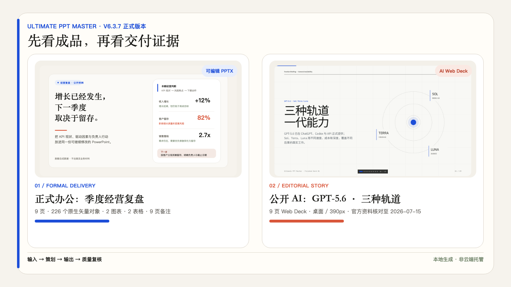

**PPT 改稿** · ppt-revise

# 领导发来的那份 PPT，改完还是原来那个模板。

> 它不替你重做一份 PPT。你手上已有带品牌、带模板的那份——要改哪页就改哪页，其余一个字、一个 logo、一处母版都不动；交出去 WPS / PowerPoint 直接能开、能继续改。

<p align="center">
  <a href="./README.en.md"><strong>English</strong></a> ·
  <a href="https://kdnsna.github.io/ultimate-ppt-master-skill/"><strong>在线工作台</strong></a> ·
  <a href="https://kdnsna.github.io/ultimate-ppt-master-skill/benchmark/"><strong>成品与 Proof</strong></a> ·
  <a href="./docs/zh-CN/README.md"><strong>中文文档</strong></a>
</p>

<p align="center">
  <a href="https://github.com/kdnsna/ultimate-ppt-master-skill/stargazers"></a>
  <a href="./LICENSE"></a>
  <a href="https://github.com/kdnsna/ultimate-ppt-master-skill/releases/tag/v6.3.8"></a>
  
  
</p>




## 它只解决一件事

多数 AI PPT 工具在比「谁更能从零生成一份漂亮初稿」。这件事 Kimi、Gamma、ChatGPT 已经做得够好，我们不抢。

我们解决的是生成之后、交付之前的那一步——**你手上已经有一份真实 PPT**（领导发的、客户给的、模板套的），要改第 5 页的图表、第 7 页的结论，可是：

- 其余页一个字都不能动；
- 官方 logo 不能糊、不能被换成近似图形；
- 母版、版式、透明度、分组、超链接不能被「重新生成」弄坏；
- 交出去 WPS / PowerPoint 要能正常打开、能继续改。

模型的本能是「整套重做」，而这恰恰会弄坏上面这些。PPT 改稿走相反的路：**你点哪页，它只动哪页**，其余在文件里原样保留，并把改前改后摆给你看。也因此，它不能通过导入并重导出整份演示来冒充局部修改——那正是会弄坏母版、透明度、分组和链接的做法。

> 好奇技术怎么做到的？没点名的部分在 `.pptx` 包里逐字节原样拷贝，只重写你点名的页和它引用的图表。详见 [定位说明](./docs/zh-CN/strategy/positioning-preserve-edit.md)。

## 我们做 / 我们不做

| 做 | 不做 |
|---|---|
| 改你指定页的标题、正文、图表、表格、形状、字体 | 不替你从零生成整套演示（那请用 Kimi / Gamma） |
| 没点名的页、logo、母版、链接、分组，原样不动 | 不把整份 PPT 倒进去再倒出来，冒充「局部修改」 |
| 统一字体、对齐、间距、对比度 | 不要求你装 Node、跑命令、连服务才能用 |
| 交回能编辑的 `.pptx`，附「改了哪些 / 没动哪些」清单 | 不把占位内容说成「已完成」 |

## 谁最适合用它

- **银行 / 政务 / 国企**：模板严、logo 和印章不能动、一份材料要被改五轮再上交。
- **咨询 / 财务 / 法务**：客户给的底稿，只换数字和结论，版式一个字都不能偏。
- **培训 / 教研**：上学期课件，这学期只更新数据和案例，其余照旧。
- **任何「手里已有一份 PPT，只想改几处」的人**——这恰恰是 AI 生成工具帮不上忙的地方。

## 为什么不让 AI 整套重做

因为你要交上去的，往往是**单位的那套模板**：固定的封面、固定的 logo 位置、固定的页脚和字号。AI 一旦「整套重做」，它是在凭印象重画这套模板——logo 偏两像素、页脚字体变了、母版颜色对不上，这些在屏幕上几乎看不出，但交上去就是「没按模板来」。

更糟的是重做会顺手抹掉原文件里你没注意到的东西：超链接、备注、分组、透明度、二维码背后的跳转。你只让它改第 7 页，它却把整份文件换了一遍，你连哪里变了都不知道。

PPT 改稿的原则因此很简单：**没让你动的，就一个字节都不动。** 你只承担你那一处修改的责任，其余交给原文件自己。

## 和「从零生成」的工具差在哪

| | Kimi / Gamma / ChatGPT | PPT 改稿 |
|---|---|---|
| 擅长 | 从一句话 / 一份资料生成一份新演示 | 在你**已有**的那份上，指哪改哪 |
| 改一处时 | 倾向整套重做，模板 / logo 容易跑偏 | 只动你点名的页，其余原样 |
| 产物 | 常是网页 Deck 或需二次排版 | 能编辑的 `.pptx`，WPS / PowerPoint 直接开 |
| 适合 | 还没有 PPT、要从头做 | 已经有 PPT、要改到能交付 |

两者不冲突：先用生成工具起个草稿，再用 PPT 改稿把它收口成「能交出去的那份」。

## 桌面端：四步改完

1. **拖进去**：把 `.pptx` 拖到窗口，不用装任何东西、不用命令行。
2. **看每页写了什么**：左侧列出每页的文字，点你要改的那页。
3. **点要改的字**：点一下文字就填进「原文 → 新文本」，也能改字体、表格、形状位置、图表数值。
4. **存**：得到一份新 `.pptx`，并告诉你「改了哪些、多少个部分没动」。

## 一个真实例子：经营复盘改三处

假设领导发来一份季度经营复盘，要你：把封面标题的「Q2」改成「Q3」、把第 4 页表格里的旧数字换成新数字、把第 6 页柱状图的图例「线上」改成「线上渠道」。

你对 Agent 说一句，或在桌面端点三下，它会：

- 在封面只替换那一个「Q2」，封面其余排版、logo 不动；
- 在第 4 页只改你指的那几个单元格，表格样式和其余行不动；
- 在第 6 页只改图例文字，图表的坐标、配色、数据系列不动；
- 其余所有页、母版、备注、超链接，原样保留。

最后它回报：「改了 3 处，涉及封面、第 4 页、第 6 页；其余 78 个部分原样没动。」你打开新文件，扫一眼这三页，就能交。

## 给 Agent 用：它会怎么改

零依赖的 MCP server（`scripts/ppt_preserve_mcp.py`）把同一套能力开放给任意 MCP 客户端。你对 Agent 说人话：

> 把这份 PPT 第 3 页的「Q2」改成「Q3」，第 6 页结论换成附件里的新数字，别的都别动。

Agent 会先读每页内容、再只改你点名的页，最后把「改了哪些 / 没动哪些」回报给你；如果它发现这次改动会越界，它会停下来告诉你，而不是悄悄交一份坏掉的文件。接入细节见 [MCP 接入指南](./docs/zh-CN/guides/mcp-server.md)。

一分钟安装（给 Agent 的技能包）：

```bash
npx skills add kdnsna/ultimate-ppt-master-skill --skill ultimate-ppt-master
```

> 安装令牌 `ultimate-ppt-master` 是机器标识，保持不变；「PPT 改稿 / ppt-revise」是给人看的名字。

## 改前改后，摆给你看

每次修改都附一份清单：哪一页改了、改了什么、其余多少个部分原样没动。仓库里还有可复现的演示：

```bash
python3 scripts/make_preserve_demo_proof.py
```

它对仓库内真实样例只改第 1 页标题，产出修复后的 `.pptx` 和改动清单 `fidelity-report.json`，以及两张对比图：矢量示意卡 `before-after.svg`、动画示意 `before-after.gif`。本机装了 LibreOffice 时，还会额外给真实像素级渲染 `before-after-real.png` / `before-after-real.gif`——上面首屏那张就是它；没装 LibreOffice 时只有示意卡。

## 本地优先，到底意味着什么

银行、政务、法务的材料常常不能出本机。PPT 改稿的桌面端和 MCP server 都在你自己的电脑上跑：你拖进去的文件、改完的文件、以及过程中产生的临时文件，都不上传、不经过任何第三方服务器。

它也不是一个「注册账号、把 PPT 传上去」的在线服务。需要模型参与时（比如让 Agent 帮你判断该改哪几处），模型调用走你本机配置的 provider；不需要模型时，纯编辑连网都不用连。

## 也能从零生成（次要路线）

如果你确实要从一段资料生成一份新演示，它也能做：PDF / Word / Excel / 网页 / 粘贴文字 → 故事板 → 可编辑 PPTX 或杂志风网页 Deck。需要可视化入口时，打开 [在线工作台](https://kdnsna.github.io/ultimate-ppt-master-skill/)；它只负责界面，干活时连你电脑上的本地 Bridge，源文件、密钥和产物默认留在本机。这条路线的完整说明在 [中文文档索引](./docs/zh-CN/README.md) 与 [Web Experience](./docs/zh-CN/guides/web-experience.md)。但本项目的主场是「改好你已有的那份」。

这条路线里，极短指令也会被「最佳效果提示增强器」自动扩写 brief，没有正式信号时用 Style A Editorial Fixed Rhythm 兜底。

## 两份能直接打开的成品

| 案例 | 直接检查 |
|---|---|
| 正式办公 PPTX · 脱敏经营复盘 | [下载可编辑 PPTX](./examples/executive-business-review-starter/executive-business-review-editable.pptx) · [看关键页](https://kdnsna.github.io/ultimate-ppt-master-skill/examples/executive-business-review-starter/web-demo.html) · [看质量报告](./examples/executive-business-review-starter/quality-report.json) |
| AI Web Deck · 杂志风公开演讲 | [打开完整演示](https://kdnsna.github.io/ultimate-ppt-master-skill/benchmark/) |

以上为脱敏演示，不含真实客户资料；正式场合请仍在目标 PowerPoint / WPS 中逐页复核。

## 常见问题

- **会不会动我的模板和 logo？** 不会。没点名的部分在文件里原样保留，模板、母版、logo、链接都不碰。
- **能改图表和表格吗？** 能。图表数值、表格单元格、文字、字体、形状位置都支持。
- **要联网 / 上传文件吗？** 不用。桌面端和 MCP 全程在本机跑，文件不出你的电脑。
- **不会用命令行行吗？** 行。桌面端是拖拽界面；命令行只是给 Agent 和开发者的另一扇门。
- **改完怎么确认没问题？** 看它给的「改了哪些 / 没动哪些」清单，并在 WPS / PowerPoint 里扫一眼改的那几页。
- **改坏了能退回去吗？** 能。它从不覆盖你的原文件，永远另存一份新的；原文件始终在。
- **支持 WPS 吗？** 支持。产物是标准 `.pptx`，WPS 和 PowerPoint 都能打开和继续编辑。

## 已知限制

- 桌面端 / MCP 的「改」目前覆盖文本、字体、表格、形状位置和图表数值；更复杂的版式重排仍建议在 PowerPoint 里收尾。
- 真实像素级「改前改后」对比需要本机有 LibreOffice；没有时给的是矢量对比卡。
- 生产级「从零生成」仍由本地 Agent 牵引，不是托管的一键云服务。
- Canva 式自由画布、多人实时协作、云账户不在范围内。

## 文档入口

| 想做什么 | 查看 |
|---|---|
| 浏览中文文档 | [中文文档索引](./docs/zh-CN/README.md) |
| 看品牌定位与「我们不做什么」 | [PPT 改稿 · 定位](./docs/zh-CN/strategy/positioning-preserve-edit.md) |
| 让 Agent 安全改 PPT | [MCP 接入指南](./docs/zh-CN/guides/mcp-server.md) |
| 了解任务型工作台 | [Web Experience](./docs/zh-CN/guides/web-experience.md) |
| 连接本地 Bridge 与 Agent | [Agent Connect Bridge](./docs/zh-CN/guides/agent-connect-bridge.md) |
| 安装 Agent Skill | [安装与启动](./docs/zh-CN/guides/agent-setup.md) |
| 选择交付路线 | [选择交付路线](./docs/zh-CN/guides/choosing-a-workflow.md) |
| 配置模型与 Provider | [模型与 Provider 配置](./docs/zh-CN/guides/model-provider-setup.md) |
| 排查问题 | [故障排查](./docs/zh-CN/guides/troubleshooting.md) |
| 查看当前正式版本 | [v6.3.8 发布说明](./docs/zh-CN/release/release-notes-v6.3.8.md) |

维护者的 API、产物表、发布门禁和兼容策略在 [`docs/`](./docs/zh-CN/README.md)，不占第一次上手的路径。

<details><summary><strong>English documentation compatibility</strong></summary>

## Documentation Map

[Agent Connect Bridge](./docs/guides/agent-connect-bridge.md) · [Agent Setup](./docs/guides/agent-setup.md) · [Hybrid-Editable Visual Workflow v4.0](./docs/quality/hybrid-editable-visual-workflow-v4.0.md) · [Simplified Web Console v4.1](./docs/release/release-notes-v4.1.0.md) · [DeckIR AI Planning Workflow v4.2](./docs/quality/deckir-ai-planning-workflow-v4.2.md) · [v4.3 Rendered Review Loop](./docs/quality/rendered-review-loop-v4.3.md) · [v5.0](./docs/release/release-notes-v5.0.0.md) · [v5.1](./docs/release/release-notes-v5.1.0.md) · [v5.2](./docs/release/release-notes-v5.2.0.md) · [v5.3](./docs/release/release-notes-v5.3.0.md) · [v5.4.1](./docs/release/release-notes-v5.4.1.md) · [v6.3.8 发布说明](./docs/release/release-notes-v6.3.8.md)
</details>

## 许可与致谢

MIT。如果它帮你把「AI 生成的幻灯片」变成真正能交出去的文件，欢迎点一个 Star，让下一个需要它的人更容易找到。
