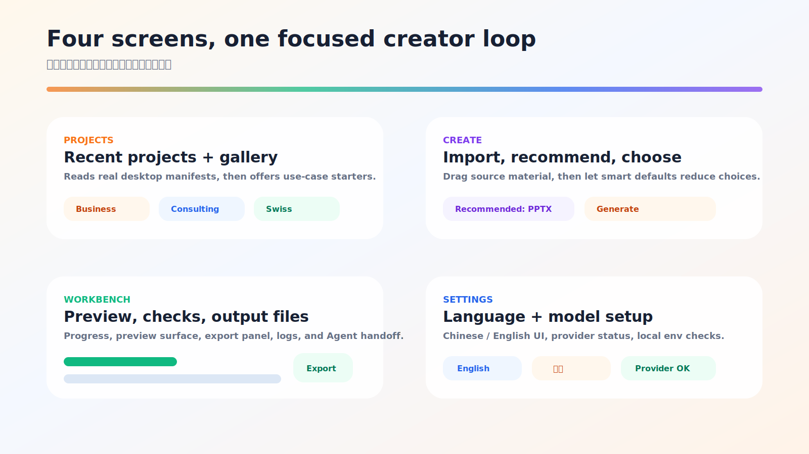
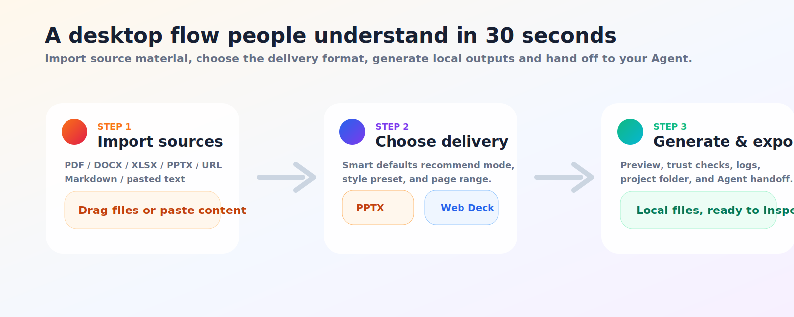

# 终极融合 PPT 大师 - AI PPT 桌面端 + Agent Skill / 可编辑 PowerPoint / 高质感网页演示

> 本地优先的 AI PPT 桌面应用和可移植 Agent Skill：把真实资料变成可编辑 PowerPoint 或高视觉 Web Deck。

<p align="center">
  <strong>v2.1.0</strong> · <a href="./README.md">English README</a> · 中文 · <a href="./apps/desktop">桌面端</a> · <a href="./docs/zh-CN">中文文档</a>
</p>


<p align="center">
  <a href="#安装桌面端"><strong>安装桌面端</strong></a>
  ·
  <a href="./README.md"><strong>English README</strong></a>
  ·
  <a href="./docs/zh-CN"><strong>中文文档</strong></a>
  ·
  <a href="#开发者--agent-接入"><strong>Agent 接入</strong></a>
</p>

<p align="center">
  
  
  
  
  
  
</p>

如果你在 GitHub 搜 **AI PPT**、**PPT 生成器**、**PowerPoint 自动化**、**PPTX 生成**、**演示文稿桌面应用** 或 **slide deck agent**，这个项目主打的是更实用的那一步：导入真实资料，选择交付场景，生成能继续编辑、能检查、能交付的演示文稿。

很多 AI 幻灯片工具停在“好看的截图”。终极融合 PPT 大师桌面端想做的是另一件事：

| 导入 | 选择 | 生成 |
|---|---|---|
| PDF、DOCX、XLSX、PPTX、URL、Markdown、粘贴文本 | 可编辑 PPTX 或高质感 Web Deck | 本地项目、预览、输出文件、日志、Agent handoff |

桌面端和 Agent Skill 都是一等入口。想要简单产品体验就用桌面端；想要生产级深度生成，就让 Codex、Claude Code、OpenClaw、Hermes 或其他代码 Agent 读取生成项目，继续执行完整工作流，逐页修正并导出。

---

## 安装桌面端

面向普通用户，公开 macOS 安装路径应该优先走 Homebrew：

```bash
brew install --cask kdnsna/ultimate-ppt-master/ultimate-ppt-master
open -a "终极融合 PPT 大师"
```

后续升级：

```bash
brew upgrade --cask ultimate-ppt-master
```

这个路径参考的是轻量 macOS 工具的分发方式：用户拿到的是预构建 app、有启动台图标、无需理解 Node/Python/Rust，也不用在源码目录里跑一堆命令。

当前仓库已经放入 Homebrew Cask 和发布约定：[Casks/ultimate-ppt-master.rb](./Casks/ultimate-ppt-master.rb)、[Homebrew Distribution](./docs/homebrew-distribution.md)。真正面向推广时，需要把签名并公证后的 release zip 发布到 `kdnsna/homebrew-ultimate-ppt-master` tap。

开发者仍可源码运行：

```bash
git clone https://github.com/kdnsna/ultimate-ppt-master-skill.git
cd ultimate-ppt-master-skill
npm run setup
npm run desktop
```

---

## 选择你的入口

| 路线 | 适合谁 | 怎么开始 |
|---|---|---|
| **桌面端** | 普通创作者、商务用户、老师、咨询顾问，以及想要三步本地流程的人。 | `brew install --cask kdnsna/ultimate-ppt-master/ultimate-ppt-master` |
| **Agent Skill** | GitHub / Agent 用户，希望获得当前最强生成质量、脚本执行、预览检查和修复循环。 | 看 [Agent Setup](./docs/agent-setup.md) |
| **桌面端 + Agent** | 团队既要简单入口，也要最终精修交付。 | 先在桌面端建项目，再复制 Workbench 的 handoff prompt。 |
| **Direct API / 自定义桥接** | 想接自己的模型 API 或 worker adapter 的开发者。 | 看 [Model and Provider Setup](./docs/model-provider-setup.md)；v2.1.0 只是预留约定。 |

如果你还不确定选哪条路线，看 [中文文档索引](./docs/zh-CN/README.md) 和 [Choosing a Workflow](./docs/choosing-a-workflow.md)。

---

## 为什么主打桌面端



终极融合 PPT 大师桌面端面向的是想用 AI 提速、但仍然需要可信交付文件的人。

| 桌面端承诺 | 为什么重要 |
|---|---|
| **三步创作流** | 导入资料、选择输出、生成导出。普通创作者不用先读脚本说明。 |
| **可编辑 PPTX 路线** | 正式材料需要在 PowerPoint 里被团队、客户、老师、领导继续修改。 |
| **高质感 Web Deck 路线** | 发布会、demo day、分享会和内部展示需要更强视觉表达。 |
| **真实 DOCX 解析** | Word 行办会/汇报材料会先转成 `source.md`，再参与预览生成，不再只是占位项目壳。 |
| **URL 转 Markdown 输入** | 可访问网页会抓取成 `source.md`；被拦截页面会明确降级为 Agent handoff。 |
| **本地优先项目** | 源文件、输出、预览、manifest 和日志默认留在本地项目目录。 |
| **Agent 兼容深水区** | 首页保持简单，专业生成能力通过 `SKILL.md` 保留。 |
| **中英双语界面** | Settings 已支持中文 / English 切换，方便国际用户。 |

它不是完整 PowerPoint 编辑器，也不声称替代 PowerPoint。它是一个聚焦导入、预览、编排、导出和 Agent handoff 的 AI PPT 桌面工作台。

---

## 它能生成什么



### 可编辑 PowerPoint (`.pptx`)

适合需要评审、修改、交付、归档的正式材料。

- 面向真实 PowerPoint 交付，不是整页截图思路。
- 适合商务汇报、咨询方案、培训课件、学术答辩、投资人更新。
- DOCX 和可访问 URL 会在本地解析成 `sources/source.md`，并立即用于 PPTX 预览生成。
- 关注真实文件价值：文本、形状、图表、备注和导出检查比表面截图更重要。
- 生产级生成由完整 Agent 工作流接管：读取资料、锁定设计规范、逐页生成、预览、校验、导出。

### 杂志风网页 PPT (`index.html`)

适合“演示本身就是体验”的场景。

- 单文件 HTML 演示，适合发布会、keynote、demo day、产品故事和强视觉内部分享。
- 内置电子杂志和 Swiss Style 两条视觉方向。
- 与 PPTX 路线共用同一份解析后的 `source.md`，一份资料可以验证双路线交付。
- 适合横向翻页、强视觉节奏和本地可分享输出。
- 是可编辑 PPTX 的视觉表达补充。

---

## 真实场景脱敏 Demo

本次发布前已用一份真实 DOCX 行办会材料在本地验证，并生成了：

- 10 页可编辑 PPTX 预览，用于正式会议审阅；
- 8 页 Web Deck 预览，用于视觉展示传播。

原始 DOCX 和原样生成件可能包含业务上下文，因此不会提交到公开仓库。公开版本只保留脱敏样例：[examples/desktop-cultural-tourism-demo](./examples/desktop-cultural-tourism-demo)，其中机构、地点、预算和审批细节均已泛化。

---

## 工作方式

桌面端保持简单，深层能力交给本地 worker 和 Agent 工作流。

| 层 | 作用 |
|---|---|
| **Tauri 桌面壳** | 轻量原生应用包装，优先 macOS，后续扩展 Windows/Linux。 |
| **React + TypeScript UI** | Projects、Create、Workbench、Settings、语言切换、Provider 状态、模型配置引导。 |
| **Python worker** | 创建本地项目、写入预览、manifest、日志和 handoff 文件。 |
| **Agent 工作流** | Codex / Claude Code / OpenClaw / Hermes 读取 `SKILL.md`，运行脚本，完成生产级生成和修正。 |

当前应用重点是用户体验闭环：导入、推荐、预览、检查、打开输出、交给 Agent 深加工。Direct LLM API Driver 已保留配置约定，但还不是完整替代 `SKILL.md` 的内置生成引擎。

---

## 开发者源码运行

仅在你想从源码启动或参与开发时使用这条路径：

```bash
git clone https://github.com/kdnsna/ultimate-ppt-master-skill.git
cd ultimate-ppt-master-skill
npm run setup
npm run desktop
```

这些命令分别做什么：

| 命令 | 用途 |
|---|---|
| `npm run setup` | 创建 `.venv`，安装 Python 依赖，安装桌面端 npm 依赖，并从模板创建 `~/.ppt-master/.env`。 |
| `npm run desktop` | 如果已安装 Rust/Cargo，会启动原生 Tauri 桌面端；否则退回只看界面的浏览器壳。 |
| `npm run doctor` | 检查 Python、Node/npm、Rust/Cargo、Cairo、provider key 和预留模型配置，不会打印密钥明文。 |
| `npm run app:desktop` | 安装 Rust/Cargo 后运行原生 Tauri 应用。 |
| `npm run package:desktop` | 构建稳定的 macOS `.app`。 |

如果你的环境不习惯从根目录使用 npm，也可以直接运行脚本：

```bash
bash scripts/bootstrap.sh
bash scripts/run-desktop.sh
```

从根目录构建前端：

```bash
npm run build:desktop
```

安装 Rust 后运行原生 Tauri 应用：

```bash
npm run app:desktop
```

构建 macOS `.app`：

```bash
npm run package:desktop
```

在 Finder 自动化可用时生成 DMG 发布包：

```bash
npm run package:desktop:dmg
```

初始化脚本不会自动安装 Rust、Homebrew、Cairo 这类系统组件。`npm run doctor` 会明确告诉你哪些可选原生依赖缺失。没有 Rust 也可以用 `npm run desktop` 打开浏览器界面壳做 UI 查看，但真实 PPTX/Web 生成需要原生 Tauri 应用，因为 Python worker 必须写入本地项目文件。

用于 Homebrew 发布的本机打包：

```bash
npm run package:desktop:homebrew
```

它会在 `dist/release/` 生成 cask 发布需要的 zip 和校验值。

---

## 大模型与 Provider 配置

生产级 PPT 需要大模型，但本项目不内置、不转售、不托管云模型。当前推荐方式是 **Agent 驱动生成**。

| 驱动方式 | 当前状态 | 适合场景 |
|---|---|---|
| **Codex / Claude Code / OpenClaw / Hermes** | 推荐，已支持 | 读资料、做策略、锁设计、逐页写稿、跑脚本、预览、修正、导出。 |
| **Agent + Provider Keys** | 已支持 | 主流程由 Agent 执行；provider key 开启生图、搜图、旁白等媒体能力。 |
| **Direct LLM API Driver** | 预留配置约定 | 后续 worker adapter 可接入 OpenAI-compatible、Gemini、Qwen 或自托管 API。 |

当前推荐：桌面端最容易上手；Agent Skill 目前效果最好，因为 Agent 能读真实文件、运行脚本、检查预览、修复导出。Direct API 变量适合自定义桥接，但在 v2.1.0 还不是完整内置生成器。

推荐本地 provider 配置：

```bash
mkdir -p ~/.ppt-master
cp .env.example ~/.ppt-master/.env
```

然后编辑 `~/.ppt-master/.env`：

```dotenv
IMAGE_BACKEND=openai
OPENAI_API_KEY=sk-xxx
OPENAI_MODEL=gpt-image-2

# 可选：图片搜索
PEXELS_API_KEY=your-pexels-key
PIXABAY_API_KEY=your-pixabay-key

# 为后续 Direct API worker adapter 预留
LLM_PROVIDER=openai-compatible
LLM_BASE_URL=https://api.openai.com/v1
LLM_API_KEY=sk-xxx
LLM_MODEL=gpt-4.1
```

桌面端 Settings 会检测当前进程环境变量、仓库 `.env` 和 `~/.ppt-master/.env`，只显示配置状态，不暴露密钥明文。

编辑 provider 配置后可以快速检查：

```bash
npm run doctor
```

完整说明见 [Model and Provider Setup](./docs/model-provider-setup.md)。

---

## 开发者 / Agent 接入

终极融合 PPT 大师也是一个可移植 Agent skill。需要让 Codex、Claude Code、OpenClaw、Hermes 或其他代码 Agent 执行完整生产流程时，用这条路径。

### 安装到 Codex

```bash
git clone https://github.com/kdnsna/ultimate-ppt-master-skill.git ~/.codex/skills/ultimate-ppt-master
cd ~/.codex/skills/ultimate-ppt-master
npm run setup
# 如果 Agent 环境没有 Node/npm，可用：bash scripts/bootstrap.sh
```

然后对 Codex 说：

```text
使用 $ultimate-ppt-master 把 reports/q3-review.pdf 做成 12 页可编辑 PPTX，用于高管汇报。
```

### Claude Code、OpenClaw、Hermes 和通用 Agent

```bash
git clone https://github.com/kdnsna/ultimate-ppt-master-skill.git ~/agent-skills/ultimate-ppt-master
cd ~/agent-skills/ultimate-ppt-master
npm run setup
# 如果 Agent 环境没有 Node/npm，可用：bash scripts/bootstrap.sh
```

通用 Agent prompt：

```text
Read ~/agent-skills/ultimate-ppt-master/AGENTS.md and follow the ultimate-ppt-master workflow.
Use the repository path as SKILL_DIR. Turn reports/q3-review.pdf into a 12-slide editable PPTX.
```

| Agent / 工具 | 推荐安装方式 | 调用方式 |
|---|---|---|
| **Codex** | `~/.codex/skills/ultimate-ppt-master` | `使用 $ultimate-ppt-master ...` |
| **Claude Code** | `~/.claude/skills/ultimate-ppt-master` 或项目可读路径 | 让 Claude 先读 `CLAUDE.md`。 |
| **OpenClaw** | 稳定本地路径，例如 `~/agent-skills/ultimate-ppt-master` | 让它读取 `AGENTS.md`。 |
| **Hermes** | 稳定本地路径，例如 `~/agent-skills/ultimate-ppt-master` | 让 Hermes 读取 `AGENTS.md`，仓库目录作为 `SKILL_DIR`。 |
| **Prompt-only Agent** | 不需要原生 skill 目录 | 粘贴或附加 `PROMPT.md`。 |

完整说明见 [Agent Setup](./docs/agent-setup.md)。通用 Agent 从 [AGENTS.md](./AGENTS.md) 开始；Claude Code 从 [CLAUDE.md](./CLAUDE.md) 开始；不支持 skill 目录的工具使用 [PROMPT.md](./PROMPT.md)。

---

## 文档导航

| 需求 | 文档 |
|---|---|
| 选择桌面端 / Skill / Direct API | [Choosing a Workflow](./docs/choosing-a-workflow.md) |
| 跑桌面端 | [Quickstart Desktop](./docs/quickstart-desktop.md) |
| 配置 Codex、Claude Code、OpenClaw、Hermes、Cursor、Cline、Roo、Windsurf | [Agent Setup](./docs/agent-setup.md) |
| 配置模型和 Provider Key | [Model and Provider Setup](./docs/model-provider-setup.md) |
| 排查安装、DOCX 解析、输出、Provider、Tauri 或 Agent 加载问题 | [Troubleshooting](./docs/troubleshooting.md) |
| 发布、CI、隐私、上游同步维护 | [Release and Maintenance](./docs/release-maintenance.md) |

---

## Roadmap

v2.1.0 之后的桌面端方向：

- 对单页进行自然语言修改。
- 在项目工作台重新生成单页。
- 模板导入向导。
- 图片搜索 / AI 生图面板。
- 分享海报和封面生成。
- Direct API worker adapter，接入 OpenAI-compatible、Gemini、Qwen 和自托管模型。
- GitHub README 示例画廊自动生成。

---

## v2.1.0 更新内容

| 更新项 | 变化 |
|---|---|
| **桌面端草稿质量升级** | 桌面端 PPTX 现在输出带设计版式的可编辑草稿，不再是简陋 bullet 烟测页。 |
| **恢复原网页模板体系** | Web Deck 现在使用杂志风 / Swiss HTML 模板、本地 `motion.min.js` 和原始 `id="deck"` 翻页系统。 |
| **中文办公标题优化** | 封面会优先抽取引号中的项目名，并避免真实 DOCX 材料里出现尴尬中文断行。 |
| **输出质量回归测试** | Worker 测试覆盖模板资源、占位符清理、DOCX 正文解析和 production-draft 预览标记。 |
| **版本链路对齐** | 仓库、桌面包、Tauri 元数据、README 资产和生成草稿页脚统一到 `v2.1.0`。 |

## v2.0.0 历史亮点

| 更新项 | 变化 |
|---|---|
| **桌面端基础能力** | 新增 `apps/desktop`，采用 Tauri + React/TypeScript + 本地 Python worker。 |
| **桌面 UX 增强** | 新增 Projects、Create、Workbench、Settings、真实 manifest、信任检查、语言切换和模型配置引导。 |
| **DOCX 输入闭环** | 桌面 worker 现在会把 DOCX 正文解析为 `source.md`，并在 manifest 中记录 `sourceExtraction` 状态。 |
| **发布检查** | 新增 CI，覆盖桌面构建、worker 单测、依赖审计和空白检查。 |
| **脱敏 Demo** | 新增文旅行办会材料脱敏样例，不提交原始私有文件。 |
| **原生构建加固** | 补齐 Tauri 图标、`Cargo.lock`、稳定 `.app` 构建命令和显式 DMG 命令。 |
| **同步上游** | 同步 `hugohe3/ppt-master` 与 `op7418/guizang-ppt-skill` 更新，并保留本仓库适配层。 |
| **双输出路线** | 可编辑 PPTX 与杂志风 HTML Deck 都作为一等输出。 |
| **多 Agent 安装指南** | 补充 Codex、Claude Code、OpenClaw、Hermes、通用 Agent 和 prompt-only 环境。 |

上游基线和适配策略见 [UPSTREAM_SYNC.md](./UPSTREAM_SYNC.md)。

---

## License

MIT. See [LICENSE](./LICENSE).
