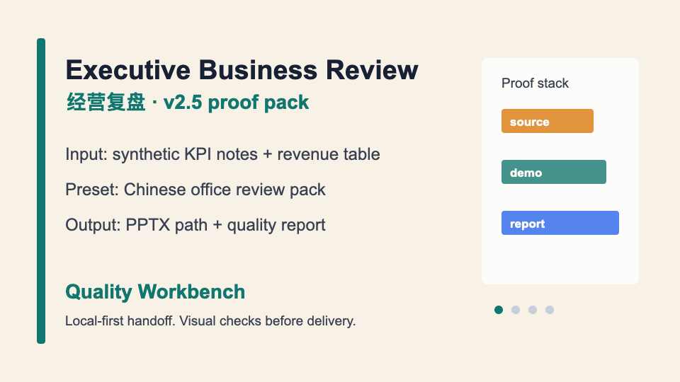

# Ultimate PPT Master - 本地优先的 AI PPT 质量工作台

> 本地优先 + 质量检查后交付 + 面向中文办公用户：把 PDF、Word、PPTX、Excel、URL 和零散笔记整理成 Agent 能直接接手的演示项目，再在本地生成可编辑 PowerPoint 或杂志风 Web Deck。

<p align="center">
  <strong>v2.5.0</strong> · <a href="./README.md">English README</a> · 中文 · <a href="./docs/zh-CN">中文文档</a> · <a href="./docs/agent-connect-bridge.md">Agent Bridge</a> · <a href="./docs/agent-setup.md">Agent Skill</a>
</p>


<p align="center">
  <a href="https://kdnsna.github.io/ultimate-ppt-master-skill/"><strong>打开 Web Experience</strong></a>
  ·
  <a href="https://kdnsna.github.io/ultimate-ppt-master-skill/benchmark/"><strong>公开案例墙</strong></a>
  ·
  <a href="./docs/zh-CN/quality-workbench-v2.5.md"><strong>质量工作台</strong></a>
  ·
  <a href="./docs/zh-CN/skill-market-distribution.md"><strong>Skill 市场</strong></a>
  ·
  <a href="./docs/completion-audit-v2.5-quality-workbench.md"><strong>完成审计</strong></a>
</p>

<p align="center">
  <a href="./docs/zh-CN/release-notes-v2.5.0.md"><strong>v2.5.0 说明</strong></a>
  ·
  <a href="#60-秒开箱即用"><strong>60 秒开箱即用</strong></a>
  ·
  <a href="#作为-agent-skill-使用"><strong>作为 Agent Skill 使用</strong></a>
  ·
  <a href="https://github.com/kdnsna/ultimate-ppt-master-skill/discussions"><strong>Discussions</strong></a>
</p>

<p align="center">
  
  
  
  
  
  
  
  
  
  
  
</p>

## 60 秒开箱即用

第一次试用，直接复制下面几行；资料始终留在你自己的电脑上：

```bash
git clone https://github.com/kdnsna/ultimate-ppt-master-skill.git
cd ultimate-ppt-master-skill
npm run setup
npm run doctor
npm run bridge
```

然后打开 [Web Experience](https://kdnsna.github.io/ultimate-ppt-master-skill/)，按你现在的安装状态选择入口：

| 当前状态 | 第一步做什么 | 你马上能看到什么 |
|---|---|---|
| **无 Bridge** | 先打开公开案例和公开案例墙。 | 不安装也能看 source、demo、封面截图和 `quality-report.json`，先判断产出是不是靠谱。 |
| **有 Bridge** | 选择中文办公预设，粘贴目标或上传本地资料，然后点 **发送 Bridge**。 | 本地生成 handoff 文件夹，包含 brief、源资料、manifest、预览、质量清单、`quality-report.json` 和 Agent 命令。 |

第一次应该点哪里：

| 步骤 | 点击 / 动作 | 结果 |
|---|---|---|
| 1 | **打开 Web Experience** | 先从产品界面开始，不用先读架构文档。 |
| 2 | **选择预设** | 经营复盘、咨询方案、培训课件/学术答辩、产品路演/科技趋势展示。 |
| 3 | 粘贴目标或导入资料 | 资料留在本地，任务说清楚。 |
| 4 | **发送 Bridge** | 连接器在线时写入本地 handoff 合同。 |
| 5 | **交给 Agent** | 让 Codex、Claude Code、Hermes、OpenClaw 或其他本地 Agent 继续生产和复查。 |

| 第一眼怎么选 | 推荐默认预设 |
|---|---|
| 我要做周报、月报、季度复盘 | **经营复盘** |
| 我要做客户方案或管理建议 | **咨询方案** |
| 我要做培训课件或学术答辩 | **培训课件 / 学术答辩** |
| 我要讲产品路演或科技趋势展示 | **产品路演 / 科技趋势 Web Deck** |

## v2.5 案例动态展示



这些都是公开合成案例：输入资料、所选预设、生成输出、封面截图和质量报告都在仓库里，别人不用安装也能先判断“它到底能产出什么”。

| 案例 | 适合 | 证明材料 |
|---|---|---|
| 经营复盘 | 经营会、部门复盘、KPI 故事线 | [Demo](https://kdnsna.github.io/ultimate-ppt-master-skill/examples/executive-business-review-starter/web-demo.html) · [Source](./examples/executive-business-review-starter/source.sanitized.md) · [Quality report](./examples/executive-business-review-starter/quality-report.json) |
| 咨询方案 | 客户诊断、转型建议、决策汇报 | [Demo](https://kdnsna.github.io/ultimate-ppt-master-skill/examples/consulting-proposal-starter/web-demo.html) · [Source](./examples/consulting-proposal-starter/source.sanitized.md) · [Quality report](./examples/consulting-proposal-starter/quality-report.json) |
| 产品路演 | 新品介绍、demo day、内部争取资源 | [Demo](https://kdnsna.github.io/ultimate-ppt-master-skill/examples/product-pitch-starter/web-demo.html) · [Source](./examples/product-pitch-starter/source.sanitized.md) · [Quality report](./examples/product-pitch-starter/quality-report.json) |
| 科技趋势 | 公开趋势分享、行业观察、技术洞察 | [Demo](https://kdnsna.github.io/ultimate-ppt-master-skill/examples/tech-trend-web-deck-starter/web-demo.html) · [Source](./examples/tech-trend-web-deck-starter/source.sanitized.md) · [Quality report](./examples/tech-trend-web-deck-starter/quality-report.json) |

## 为什么值得 Star

| 如果你需要... | Ultimate PPT Master 给你... |
|---|---|
| 一个不把源文件藏起来的 AI PPT 生成器 | 本地优先的 Web Experience + Bridge 项目包。 |
| 真正可编辑的 PowerPoint，而不是整页截图 | 面向 PPTX 的 Agent Skill 路线和质量检查。 |
| 从混乱 PDF、Word、PPTX、URL、笔记里更快起稿 | stable pack、source 骨架、manifest、QA 清单和质量报告。 |
| 用网页做杂志风汇报或演示 | Web Deck 路线、浏览器预览和可分享 HTML 输出。 |

## 这是个什么项目

Ultimate PPT Master 是一个 **本地优先的 AI 演示生产中枢**。它不是单纯的 prompt 生成器，也不是把资料上传到云端的 PPT 网站，而是先用一个亲民网页把需求讲清楚，再把真实资料整理成本地 Agent 可以继续生产的 handoff 项目。

它想融合两条优秀路线：

- Hugo He / PPT Master 代表的可编辑 PPTX 生产路线；
- op7418 / 歸藏风格 Skill 代表的高质感单文件 Web Deck 路线。

一句话：**网页负责让普通用户一眼看懂、一键开始；Skill 负责让本地 Agent 做深度、高质量生产。**


## v2.5.0 发布重点

v2.5.0 把 Ultimate PPT Master 定位成 **面向中文办公用户的 PPT 质量工作台**。它继续保持本地优先的 Web + Bridge + Skill 架构，不把项目变成黑盒云生成器。

这次重点放在普通用户能不能更容易上手、Agent 产出能不能更可验收：

- 经营复盘、咨询方案继续作为默认路径；培训课件、学术答辩在网页预设菜单里前移；
- stable pack 新增 `userLevel`、`qualityProfile`、`proofArtifacts`、`notFor`，说明适合谁、不适合谁、要交付什么；
- Design Doctor 把 SVG 检查、浏览器视觉复查、`workflows/visual-review.md`、`quality-report.json` 和中文摘要组合成一个用户能理解的步骤；
- Bridge / handoff kit 会把 `qualityProfile`、`expectedArtifacts`、`reviewCommands` 写进 `manifest.json` 和 `project-brief.json`；
- 新增 `scripts/audit_quality_proofs.py`，发布前检查 stable pack 的公开证明。

### v2.5.0 白话更新栏

- 首页不再右侧空着：现在会显示当前任务、下一步、质量状态和交付门禁。
- 预设不再只是方向建议：stable pack 必须有公开合成资料、生成输出、截图、质量报告和适用边界。
- Agent 收到的不只是一段 prompt，而是一份可验收合同。
- Design Doctor 默认先报告和建议，只有用户明确要求时才自动修 SVG。

## 质量证明

公开案例墙不是一句链接，而是这个项目证明自己“能交付”的第一现场。打开 [Benchmark Wall](https://kdnsna.github.io/ultimate-ppt-master-skill/benchmark/)，可以直接看到“输入 -> 预设 -> 输出 -> 复查”的完整链路。

每个 proof pack 都包含：

- `source.sanitized.md`：公开合成资料，别人可以直接审；
- 生成输出：对应预设的 Web Deck 或 starter output；
- screenshot / cover：快速判断视觉质感；
- `quality-report.json`：机器可读的质量报告；
- Design Doctor scorecard：默认只报告和建议的视觉复查结果。

Design Doctor 默认 report-only：它会组合 SVG 检查、浏览器视觉复查、`workflows/visual-review.md`、`quality-report.json` 和中文摘要；只有用户明确要求时，才自动修 SVG。

质量证明矩阵：[v2.5 质量工作台](./docs/zh-CN/quality-workbench-v2.5.md)。完成审计：[Completion Audit](./docs/completion-audit-v2.5-quality-workbench.md)。路线文档：[下一步路线 - 内容与模板预设](./docs/zh-CN/next-roadmap.md)。预设目录：[templates/presets](./templates/presets)。

## Skill 市场分发

下一步不只做 GitHub Pages 展示，也要把 Skill 市场分发准备好，让别人看到仓库第一眼就知道它能作为 Agent Skill 安装和调用。

市场分发资产：

- `agents/openai.yaml`：OpenAI / Codex 风格的 Skill 元数据和调用示例；
- `agents/marketplace-listing.json`：结构化上架合同；
- `assets/skill-market/*`：上架图标和卡片视觉资产；
- 公开 benchmark：证明这个 Skill 能产出经过质量检查的样例；
- `npm run audit:market`：机器检查市场元数据、链接和资产。

可复制的 marketplace prompt：

```text
Use $ultimate-ppt-master to turn my source material into a quality-checked PPTX or Web Deck with a visual review report.
```

查看清单：[Skill 市场分发](./docs/zh-CN/skill-market-distribution.md)。英文清单：[Skill Market Distribution](./docs/skill-market-distribution.md)。

## 为什么不直接让 Codex 安装 Skill？

可以。对专家用户来说，直接安装 Skill 仍然是最快路径。

Ultimate PPT Master 解决的是这之前的一分钟：用户有文件、有粗略目标、模型配置不确定，也不知道应该输出可编辑 PPTX、Web Deck，还是两者都要。

这个产品的价值是：

- 把模糊需求变成结构化 brief；
- 把真实资料整理成本地 handoff 文件夹；
- 在生产前显示 Bridge、Agent、provider 是否可用；
- 自动生成 engine plan、质量检查清单和质量报告；
- 保留原作者路线的质量上限，而不是替换成弱网页生成器。

更完整的反思见：[产品定位反思](./docs/zh-CN/product-positioning.md)。

## 一键更新

最近版本迭代比较快，已经安装过的用户建议先更新再生产正式材料。

本地仓库更新：

```bash
cd ultimate-ppt-master-skill
npm run update
```

Codex Skill 更新：

```bash
bash -lc 'set -e; dir="$HOME/.codex/skills/ultimate-ppt-master"; if [ -d "$dir/.git" ]; then git -C "$dir" pull --ff-only; else git clone https://github.com/kdnsna/ultimate-ppt-master-skill.git "$dir"; fi; cd "$dir"; npm run setup'
```

通用 Agent Skill 更新：

```bash
bash -lc 'set -e; dir="$HOME/agent-skills/ultimate-ppt-master"; if [ -d "$dir/.git" ]; then git -C "$dir" pull --ff-only; else mkdir -p "$HOME/agent-skills"; git clone https://github.com/kdnsna/ultimate-ppt-master-skill.git "$dir"; fi; cd "$dir"; npm run setup'
```

也可以直接让 Codex 做：

```text
请把 ~/.codex/skills/ultimate-ppt-master 更新到 GitHub 最新版，运行 npm run setup，然后用 README 里的示例确认它可用。
```

## 输入到产出示例


这个公开样板把“用户应该给什么”和“最终能看到什么”放在一起：

| 你给它 | 它生成 |
|---|---|
| 一份脱敏 `source.md`，包含主题、公开资料来源、叙事方向、页纲和约束。 | 一个可打开的单文件 Web Deck，以及给本地 Agent 继续生产 PPTX / Web Deck 的 handoff 结构。 |
| 一段明确的 Agent prompt，说明目标受众、输出形式和质量检查要求。 | `agent-prompt.md`、`engine-plan.md`、`quality-checklist.md` 这类可复现生产文件。 |

示例输入材料节选：

```text
主题：Agentic Developer Stack 2026
目标：用一个非敏感科技热点解释“网页负责入口，Skill 负责生产”的产品方向。
资料：Google I/O 2026 developer highlights、Google Developers Blog、公开技术报道。
输出：11 页杂志风 Web Deck；同时保留可交给 Agent 继续生成 PPTX 的 handoff 路线。
```

示例 Agent prompt：

```text
Use $ultimate-ppt-master with examples/agentic-developer-tools-2026/source.sanitized.md.
Create a polished magazine-style Web Deck for GitHub Pages and keep the handoff ready for an editable PPTX route.
Verify layout, mobile readability, source references, and final exported files before delivery.
```

查看完整样板：

- [输入材料 source.sanitized.md](./examples/agentic-developer-tools-2026/source.sanitized.md)
- [生成产品 Web Deck](https://kdnsna.github.io/ultimate-ppt-master-skill/examples/agentic-developer-tools-2026/web-demo.html)
- [示例说明](./examples/agentic-developer-tools-2026)

## Web Experience


Web Experience 是项目的主推广入口。它可以直接跑在 GitHub Pages 上，不需要后端、不需要账号、不托管模型，也不会在浏览器保存 API key。

它可以帮用户：

- 导入 `.md`、`.txt`、`.pdf`、`.docx`、`.pptx`、`.xlsx`、URL 或粘贴文本；
- 选择目标场景、受众、输出路线、视觉风格、语言、Agent 工具和模型偏好；
- 看清每个资料是“浏览器已读”“Bridge 可解析”还是“作为附件保留”；
- 生成可复制的 Agent handoff prompt，并下载 `source.md` 模板；
- 预览一个粗版 `preview-web-deck.html`；
- Bridge 离线时下载 `handoff-kit.zip`；
- Bridge 在线时直接把项目写入本地工作区；
- 一键跳转到 Skill 安装说明。

在线入口：

```text
https://kdnsna.github.io/ultimate-ppt-master-skill/
```

本地开发网页：

```bash
npm --prefix apps/web install
npm run dev:web
```

构建 GitHub Pages 静态产物：

```bash
npm run build:web
```

## 连接本地 Agent

Bridge 会把静态网页升级成本地生产控制台。

```bash
git clone https://github.com/kdnsna/ultimate-ppt-master-skill.git
cd ultimate-ppt-master-skill
npm run setup
npm run bridge
```

Bridge 会把 handoff 项目写到：

```text
~/UltimatePPTMaster/handoffs/
```

默认安全策略：

- 只绑定 `127.0.0.1`；
- 从环境变量、仓库 `.env` 或 `~/.ppt-master/.env` 读取 provider 配置；
- 只返回 provider 是否可用和模型名，不返回 API key 内容；
- 通过 `scripts/source_to_md/*` 在本地解析资料；
- 默认不自动拉起任何 Agent。

高级自动拉起模式需要显式开启：

```bash
npm run bridge -- --allow-launch
```

完整说明：[Agent Connect Bridge](./docs/agent-connect-bridge.md)。

## Handoff Kit 长什么样


每个 handoff 项目都同时给人和 Agent 看：

- `source.md`：干净的兜底资料；
- `extracted-source.md`：Bridge 尽量解析出的正文；
- `attachments/`：保留原始文件；
- `manifest.json`：资料状态、解析状态和建议命令；
- `agent-prompt.md`：可复制给 Agent 的完整提示词；
- `project-brief.json`：目标场景、受众、风格和输出配置；
- `engine-plan.md`：PPTX / Web Deck 生产计划；
- `quality-checklist.md`：交付前检查清单；
- `quality-report.json`：Design Doctor 和交付门禁结果；
- `preview-web-deck.html`：浏览器本地粗预览；
- `README.md`：handoff 文件夹说明。

## 作为 Agent Skill 使用

当用户已经在用 Codex、Claude Code、Hermes、OpenClaw、Cursor 类 IDE 或其他能读文件、能跑脚本的本地 Agent 时，Skill 是第二核心入口，也是当前质量最强的生产路线。

### Codex

```bash
git clone https://github.com/kdnsna/ultimate-ppt-master-skill.git ~/.codex/skills/ultimate-ppt-master
cd ~/.codex/skills/ultimate-ppt-master
npm run setup
```

然后这样问：

```text
Use $ultimate-ppt-master to turn reports/q3-review.pdf into a 12-slide editable PPTX for an executive meeting. Verify the deck before delivery.
```

### Claude Code、Hermes、OpenClaw 和通用 Agent

```bash
mkdir -p ~/agent-skills
git clone https://github.com/kdnsna/ultimate-ppt-master-skill.git ~/agent-skills/ultimate-ppt-master
cd ~/agent-skills/ultimate-ppt-master
npm run setup
```

Agent prompt：

```text
Read ~/agent-skills/ultimate-ppt-master/AGENTS.md and follow SKILL.md.
Use that repository path as SKILL_DIR.
Turn the provided source material into an editable PPTX and preview the result before delivery.
```

完整说明：[Agent Setup](./docs/agent-setup.md)。

## 输出路线


| 输出 | 适合什么 | 推荐路线 |
|---|---|---|
| **可编辑 PowerPoint (`.pptx`)** | 商务汇报、咨询方案、培训课件、投资人更新，以及需要反复评审修改的正式材料。 | Agent Skill 读取真实资料，运行脚本，预览，修复，再导出。 |
| **杂志风 Web Deck (`index.html`)** | 发布会、Demo Day、产品故事、keynote、强视觉分享。 | Web Experience 先出粗预览，Skill 做最终打磨和 QA。 |
| **Agent Handoff Project** | 已经在用 Codex、Claude Code、Hermes、OpenClaw、Cursor、Cline、Roo、Windsurf 的用户。 | Bridge 生成本地项目，或下载 `handoff-kit.zip`。 |

公开脱敏示例：

- [经营复盘 Starter](./examples/executive-business-review-starter)
- [咨询方案 Starter](./examples/consulting-proposal-starter)
- [产品路演 Starter](./examples/product-pitch-starter)
- [科技趋势 Web Deck Starter](./examples/tech-trend-web-deck-starter)
- [Agentic Developer Stack 2026](./examples/agentic-developer-tools-2026)
- [Desktop Cultural Tourism Demo](./examples/desktop-cultural-tourism-demo)

## 选择你的入口

| 路线 | 适合谁 | 怎么开始 |
|---|---|---|
| **打开 Web Experience** | 新用户、GitHub 访客、公开传播、轻量试用。 | [打开 Web Experience](https://kdnsna.github.io/ultimate-ppt-master-skill/) |
| **Web + Bridge** | 想导入真实文件，但不想上传资料到托管服务的用户。 | 运行 `npm run bridge`，再从网页发送。 |
| **Agent Skill** | 已经在用 Codex、Claude Code、Hermes、OpenClaw、Cursor、Cline、Roo、Windsurf。 | [Agent Setup](./docs/agent-setup.md) |
| **Web + Skill** | 推荐生产流程：网页端先整理 handoff kit，再让 Agent 本地深度生产。 | 使用 Web Experience，然后走 Bridge 或 `handoff-kit.zip`。 |
| **桌面端 Later** | 高级本地预览和后续签名桌面端分发。 | [Quickstart Desktop](./docs/quickstart-desktop.md) |

## 桌面端 Later

Tauri 桌面端仍保留在 [apps/desktop](./apps/desktop)，但不再作为近期首推安装路径。签名、公证、Homebrew 分发和原生打包都放到发布维护路线里。

开发者源码预览：

```bash
git clone https://github.com/kdnsna/ultimate-ppt-master-skill.git
cd ultimate-ppt-master-skill
npm run setup
npm run desktop
```

发布维护参考：

- [Quickstart Desktop](./docs/quickstart-desktop.md)
- [Homebrew Distribution Plan](./docs/homebrew-distribution.md)
- [Release and Maintenance](./docs/release-maintenance.md)

## 文档

| 需求 | 文档 |
|---|---|
| 使用静态在线入口 | [Web Experience](./docs/zh-CN/web-experience.md) |
| 连接网页、本地资料和 Agent | [Agent Connect Bridge](./docs/zh-CN/agent-connect-bridge.md) |
| 安装和调用 Skill | [Agent Setup](./docs/agent-setup.md) |
| 选择 Web / Skill / Desktop Later | [Choosing a Workflow](./docs/choosing-a-workflow.md) |
| 本地配置 provider key | [Model and Provider Setup](./docs/model-provider-setup.md) |
| 理解它为什么不只是“多装一个 Skill” | [产品定位反思](./docs/zh-CN/product-positioning.md) |
| 查看下一步内容 / 模板方向 | [下一步路线 - 内容与模板预设](./docs/zh-CN/next-roadmap.md) |
| 查看 v2.5.0 发布重点 | [发布说明 - v2.5.0](./docs/zh-CN/release-notes-v2.5.0.md) |
| 查看质量证明矩阵 | [v2.5 质量工作台](./docs/zh-CN/quality-workbench-v2.5.md) |
| 浏览公开案例墙 | [Benchmark Wall](https://kdnsna.github.io/ultimate-ppt-master-skill/benchmark/) |
| 准备 Skill 市场分发 | [Skill 市场分发](./docs/zh-CN/skill-market-distribution.md) |
| 查看 v2.5 完成审计 | [完成审计](./docs/completion-audit-v2.5-quality-workbench.md) |
| 查看 GitHub 技术趋势 | [GitHub 技术扫描 - 2026 年 5 月](./docs/zh-CN/github-tech-scan-2026-05.md) |
| 查看本机上游基准测试 | [上游基准测试 - 2026 年 5 月](./docs/zh-CN/upstream-benchmark-2026-05.md) |
| 排查安装、解析、输出、provider、Tauri 或 Agent 加载问题 | [Troubleshooting](./docs/troubleshooting.md) |
| 发布、Pages、Homebrew、签名、公证、隐私和维护 | [Release and Maintenance](./docs/release-maintenance.md) |

## 发布前稳定性

维护者要把 README 首页承诺和可执行门禁绑在一起：

```bash
npm run doctor
npm run audit:presets
npm run audit:quality
npm run audit:market
npm run test:node
npm run test:worker
npm run build:web
npm run build:desktop
git diff --check
```

当前推送前验收也覆盖了 Web 首页、公开案例墙、4 个公开案例 deck 的桌面和移动宽度。

## v2.5.0 重点变化

- Web 第一屏升级为质量工作台，显示任务预览、下一步和质量状态。
- 四个当前 pack 升级为 `stable-pack`，带质量元数据和公开证明产物。
- 新增 Design Doctor 入口，并把 `quality-report.json` 写进 handoff kit。
- 新增 `npm run audit:quality` 的质量证明审计。
- 新增 `npm run audit:market` 的 Skill 市场分发审计。
- Bridge manifest 和 project brief 增加质量目标、预期产物和检查命令。

上游同步与本地适配策略见 [UPSTREAM_SYNC.md](./UPSTREAM_SYNC.md)。

## 项目 About

AI presentation hub: source files in, local Agent handoff out, editable PPTX and magazine Web Decks delivered.<br>
AI 演示生产中枢：资料进来，本地 Agent 接手，输出可编辑 PPTX / 杂志风网页演示。

## License

MIT. See [LICENSE](./LICENSE)。
