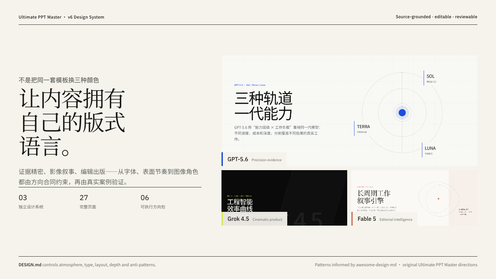
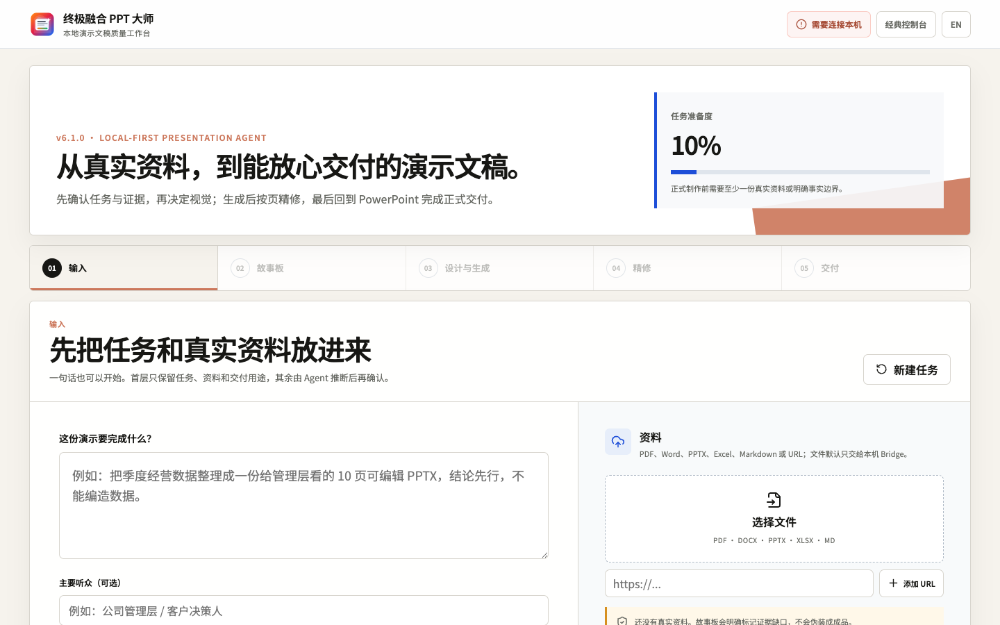

# Ultimate PPT Master v6 · 终极融合 PPT 大师

> 从真实资料出发，在本地完成一份可编辑、可审阅、能放心交付的演示文稿。

<p align="center">
  <a href="./README.md"><strong>English</strong></a> ·
  <a href="https://kdnsna.github.io/ultimate-ppt-master-skill/"><strong>在线体验工作台</strong></a> ·
  <a href="https://kdnsna.github.io/ultimate-ppt-master-skill/benchmark/"><strong>查看 Proof Packs</strong></a> ·
  <a href="./docs/zh-CN/release/release-notes-v6.1.0.md"><strong>v6.1 发布说明</strong></a>
</p>

<p align="center">
  <a href="https://github.com/kdnsna/ultimate-ppt-master-skill/stargazers"></a>
  <a href="./LICENSE"></a>
  
  
  
</p>



多数 AI PPT 产品优化的是“第一眼看起来像成品”。Ultimate PPT Master 更在意另一刻：这份文件被带进真实会议、在 PowerPoint 里继续修改、被追问数据来源，并最终交给另一个人使用。

它不是另一个自由画布编辑器，而是一套面向中文正式办公、企业资料和高要求交付的本地演示文稿 Agent 与质量操作系统。适合正式汇报、咨询方案、培训课件、政务金融材料、品牌发布和需要审阅留痕的工作。

## v6 到底改了什么

v6 不再让用户先面对 Bridge、Provider、DeckIR 和脚本，而是围绕四个真实任务工作：

1. **输入**：说清要做什么，加入文件、URL 或已有 PPTX，选择交付用途。
2. **故事板**：Agent 最多补问三个真正影响结果的问题，然后展示页面任务、证据和缺口。
3. **设计与生成**：先比较三个真实视觉方向，快速生成结构稿，再渐进式精修。
4. **精修与交付**：基于稳定 `slideId` 单页修改、检查质量问题，最后回到 PowerPoint 完成正式交付。



Bridge、模型设置、脚本、DeckIR 和 JSON 合同仍然保留，但被移入专业模式与诊断路径。旧版四步控制台还会保留一个兼容周期，可通过 `?classic=1` 打开。

## 为什么不是“又一个 AI PPT”

| 常见问题 | Ultimate PPT Master 的处理方式 |
|---|---|
| 极短指令直接生成一套自信但空泛的模板页 | **最佳效果提示增强器**先生成**自动扩写 brief**，把假设、受众、场景和成功标准显式化。 |
| 预览很漂亮，下载后却是一张张死图 | 尽量保留 PowerPoint 文字、形状、表格、图表、备注等原生可编辑对象。 |
| 生成过程中来源和证据消失 | 保留 source map、证据绑定、素材来源和可信边界。 |
| 改一句话就要整套重做 | 使用稳定 `slideId`、单页修订请求、恢复点和素材哈希缓存。 |
| 所有页面都收敛成“大标题＋三个卡片” | 使用视觉方向包、页面角色、页面配方和重复布局审计。 |
| 没配置生图或模型密钥就整套失败 | 明确输出 `Needs-Manual` 提示词和文件名，不伪装为已经完成。 |
| 文件看起来对，交给别人却改不动 | 用渲染审阅、PowerPoint 原生对象检查和当前产物 digest 绑定导出门禁。 |

## 路线选择：先选对交付路线

| 你的场景 | 推荐路线 | 最终产物 |
|---|---|---|
| 正式汇报、咨询方案、培训材料、政务/金融内容，或需要别人继续修改 | **可编辑 PowerPoint** | 带可编辑内容、备注和质量证据的 `.pptx` |
| 发布会、公开演讲、Demo Day、编辑叙事或浏览器优先展示 | **杂志风 Web Deck** | **Style A Editorial Fixed Rhythm** 或 Style B 瑞士国际主义 HTML Deck |
| 既要浏览器展示，又要正式文件 | **双交付** | 共用资料与策划记录、分开生成的 Web 与 PPTX 项目 |

PowerPoint 仍是正式成品的主要编辑环境。Ultimate PPT Master 负责它周围最耗时间也最容易失控的部分：资料输入、叙事策划、视觉方向、素材合规、生成、质量审计、审阅与失败恢复。

## 60 秒开箱即用 · 依赖与降级

需要 Python 3.10+、Node.js 18+ 和 npm。只有打包原生桌面应用时才需要 Rust。

```bash
git clone https://github.com/kdnsna/ultimate-ppt-master-skill.git
cd ultimate-ppt-master-skill
npm run setup
npm run doctor
npm run bridge
```

然后打开 [v6 Web 工作台](https://kdnsna.github.io/ultimate-ppt-master-skill/)。在线页面只连接本机 `127.0.0.1` 上的 Bridge；源文件和 handoff 项目继续留在你的电脑上。

如果从 Agent 直接使用，安装或链接 Skill 后自然描述任务即可：

```text
使用 $ultimate-ppt-master，把这份季度经营复盘和附件 Excel
整理成一份给管理层看的 10 页可编辑 PPTX。结论先行，
所有数字都要能追溯；上一版 PPT 只学习视觉风格，不复制内容。
```

你不需要学习特殊“咒语”。v6 会推断低风险设置，只在受众、证据、品牌/IP 权限或交付预期确实会改变结果时提问。

## 你会得到什么

- 可编辑 PPTX 路线：Office 安全字体、讲者备注和原生对象回归检查。
- Style A 电子杂志/电子墨水与 Style B 瑞士信息设计 Web Deck，并配有结构验证器。
- 参考 PPT 学习：提取母版、版式节奏、主题字体与颜色、占位符和常用页面角色。
- 六套完整视觉方向：同时覆盖封面、正文、数据、图表、图片、章节和结尾。
- 每页先给三个结构变体，再进入高成本精修。
- 单页重生成、断点恢复、附件哈希缓存和增量进度事件。
- 本地优先的资料处理、Provider 密钥隔离和明确的官方/IP 素材规则。
- Web 与 Desktop 共用 `DeckSession` 阶段和设计令牌。

## 一套 Agent 真能执行的设计系统

根目录 [`DESIGN.md`](./DESIGN.md) 统一锁定氛围、语义色、字体角色、组件语法、版式、层次、反模式、响应式行为和生成前必填字段。六套视觉方向是可执行合同，不再是同一模板换色；每套都有自己的字体性格、构图模型、表面节奏、图片行为、形状语法和 Prompt。系统的表达方式借鉴了 [`awesome-design-md`](https://github.com/VoltAgent/awesome-design-md)，并吸收最新版 [`guizang-ppt-skill`](https://github.com/op7418/guizang-ppt-skill) 与 [`baoyu-design`](https://github.com/JimLiu/baoyu-design) 的生产纪律：先写标题序列、使用登记配方、每页一个视觉主角、预先规划亮/暗/图片节奏、使用标准图片槽位、保持投影级字号与底部安全留白，最后逐页进行浏览器渲染审阅。这里借鉴的是方法，不复制模板或第三方品牌身份。

## 完整演示与真实 Proof Packs

先打开 [演示成品库](https://kdnsna.github.io/ultimate-ppt-master-skill/benchmark/)：上层三套各 9 页的完整 Deck，分别验证“证据精密、影像产品、编辑叙事”三种真正不同的系统；下层保留稳定 Proof Packs 的证明链。GPT-5.6 和 Claude Fable 5 使用官方发布资料；用户提到的“Grok 4.6”截至 2026-07-10 未找到官方发布，案例因此改为官方最新可核验版本 Grok 4.5。Proof Pack 分数仍是 Design Doctor 自评，不包装成第三方 benchmark。

| 案例 | 可检查产物 |
|---|---|
| GPT-5.6 · 三种轨道 | [打开 9 页成品](https://kdnsna.github.io/ultimate-ppt-master-skill/examples/ai-frontier-2026/gpt-5-6.html) |
| Grok 4.5 · 工程效率曲线 | [打开 9 页成品](https://kdnsna.github.io/ultimate-ppt-master-skill/examples/ai-frontier-2026/grok-4-5.html) |
| Claude Fable 5 · 长周期工作 | [打开 9 页成品](https://kdnsna.github.io/ultimate-ppt-master-skill/examples/ai-frontier-2026/claude-fable-5.html) |
| 经营复盘 | [打开稳定 Proof](https://kdnsna.github.io/ultimate-ppt-master-skill/examples/executive-business-review-starter/web-demo.html) |
| 咨询方案 | [打开稳定 Proof](https://kdnsna.github.io/ultimate-ppt-master-skill/examples/consulting-proposal-starter/web-demo.html) |
| 产品发布 | [打开稳定 Proof](https://kdnsna.github.io/ultimate-ppt-master-skill/examples/product-pitch-starter/web-demo.html) |
| 科技趋势 Web Deck | [打开稳定 Proof](https://kdnsna.github.io/ultimate-ppt-master-skill/examples/tech-trend-web-deck-starter/web-demo.html) |

## HTTP API 与服务器部署

v6 已经提供真实可调用的 HTTP Bridge，用于任务准备和编排：

| 接口 | 作用 |
|---|---|
| `POST /handoff` | 落盘 brief、附件、故事板和生产合同 |
| `GET /events` | 通过 SSE 流式返回只读进度事件 |
| `POST /slides/regenerate` | 基于稳定 slideId 写入单页修订请求 |
| `GET /health`、`GET /providers` | 检查环境和 Provider 是否就绪，不返回密钥 |
| `POST /agent/launch` | 返回或在明确授权后启动白名单内的本地 Agent 命令 |

当前 Bridge **不是**可以直接暴露到公网、带认证和队列的独立 `POST /generate` 服务。它为了安全默认只监听本机。部署到服务器仍需要二选一：

1. 安装 Codex、Claude Code、OpenClaw 等 Agent Runner，由它执行 Skill；或
2. 自己编排 Worker，调用仓库脚本，持久化 `DeckSession`，执行质量门禁并发布产物。

不要把当前 Bridge 直接暴露到互联网。边界与部署方式详见 [Agent Connect Bridge](./docs/zh-CN/guides/agent-connect-bridge.md)。

## 关键产物合同

重要决定写入文件，因此流程可以检查、恢复和续跑：

| 文件 | 它证明什么 |
|---|---|
| `project-brief.json` | 用户需求、自动扩写 brief、路线、假设与 `expectationFit` |
| `storyboard.json` | 稳定 slideId、页面角色、结构变体、证据引用和可编辑目标 |
| `asset_plan.json` | 每个图片槽、来源策略与状态；Generated 行写入 `current_generation_evidence` |
| `source-map.json` | 演示文稿实际使用的可追溯来源主张 |
| `spec_lock.md` | 控制视觉一致性的紧凑执行合同 |
| `quality-report.json` | 渲染审阅发现、交付准备度和已知阻断 |
| `pipeline-state.json` | 证明导出绑定的是最新通过检查的产物 digest |

## 贡献者可以直接运行的质量门禁

```bash
npm run test:node
npm run test:worker
npm run build:web
npm run build:desktop
npm run audit:v6-workspace
npm run audit:web-console
npm run audit:docs
npm run audit:image-contracts
npm run audit:featured-decks
```

正式 PPTX 项目还可以运行：

```bash
python3 scripts/audit_formal_delivery.py <project>
python3 scripts/audit_design_completion.py <project>
python3 scripts/audit_visual_recipes.py <project>
python3 scripts/audit_pptx_native_objects.py <final.pptx> --expect text,shape
```

## 架构一眼看懂

```text
Web / Desktop 工作台
        │
        ▼
DeckSession  ── intake → outline → generating → review → delivered
        │
        ▼
本地 Bridge ── 来源提取 · SSE · handoff · 单页修订 · 缓存
        │
        ▼
Agent / 编排器 ── 故事板 · 素材计划 · 生成 · 审计
        │
        ├── 可编辑 PPTX
        └── 杂志风 Web Deck
```

旧版 `project-brief.json`、`storyboard.json`、`asset_plan.json`、`quality-report.json` 与 Bridge handoff 在 v6 继续兼容。

## 安全与可降级设计

- Bridge 默认只监听 localhost，绝不把 Provider 密钥返回给浏览器。
- 私有资料保持本地，除非用户明确同意上传。
- 官方 Logo、二维码、印章、卡面和活动 IP 必须来自官方/用户文件，否则明确阻塞对外发布。
- 生成图片不承载中文正文；标签与文字放在可编辑或矢量层。
- 缺少生图后端时输出可执行提示词和目标文件名，不伪造成功。
- 没有真实资料时，界面不会把示例预览伪装成最终成品。

## 已知限制

- 生产级生成仍由 Agent/编排器牵引；Bridge 暂时不是多租户无头服务，超过约 16 页的项目建议在策划完成后使用断点续跑流程。
- PowerPoint 渲染会受到 Office 版本和本机字体影响，对外交付前应运行原生对象与视觉检查。
- Canva 式自由画布、复杂多人协作和营销 Deal Room 暂不属于 v6 范围。

<details><summary><strong>历史能力与规范发布入口</strong></summary>

[v4.0 混合可编辑视觉工作流](./docs/zh-CN/quality/hybrid-editable-visual-workflow-v4.0.md) · [v4.1 精简网页控制台](./docs/zh-CN/release/release-notes-v4.1.0.md) · [v4.2 DeckIR AI 策划工作流](./docs/zh-CN/quality/deckir-ai-planning-workflow-v4.2.md) · [v4.3 渲染审阅闭环](./docs/zh-CN/quality/rendered-review-loop-v4.3.md) · [发布说明 - v5.0.0](./docs/zh-CN/release/release-notes-v5.0.0.md) · [发布说明 - v5.1.0](./docs/zh-CN/release/release-notes-v5.1.0.md) · [发布说明 - v5.2.0](./docs/zh-CN/release/release-notes-v5.2.0.md) · [发布说明 - v5.3.0](./docs/zh-CN/release/release-notes-v5.3.0.md) · [v5.4 瑞士风 Deck 与资产工厂](./docs/zh-CN/release/release-notes-v5.4.1.md)（`examples/swiss-v54-demo/index.html`、`npm run audit:swiss-deck`）· [v6.1.0](./docs/zh-CN/release/release-notes-v6.1.0.md)
</details>

## 文档地图

| 想做什么 | 查看 |
|---|---|
| 了解 v6 工作台 | [Web Experience](./docs/zh-CN/guides/web-experience.md) |
| 连接本地文件和 Agent | [Agent Connect Bridge](./docs/zh-CN/guides/agent-connect-bridge.md) |
| 安装 Agent Skill | [Agent Setup](./docs/guides/agent-setup.md) |
| 选择 PPTX、Web Deck 或 Desktop | [Choosing a Workflow](./docs/guides/choosing-a-workflow.md) |
| 配置模型与 Provider | [Model and Provider Setup](./docs/guides/model-provider-setup.md) |
| 查看 v6 变化 | [v6.1.0 发布说明](./docs/zh-CN/release/release-notes-v6.1.0.md) |
| 排查问题 | [Troubleshooting](./docs/guides/troubleshooting.md) |

## 参与贡献

欢迎提交 Issue、可复现资料案例、Proof Pack、视觉方向、Provider Adapter 和质量检查。README 里的公开承诺应始终绑定可执行测试、审计、公开案例或发布说明。

## 许可与致谢

MIT。最新版 Guizang PPT Skill 与 Baoyu Design 的方法启发了登记版式、节奏、可编辑交付和审阅纪律；本仓库保持原创视觉方向、独立实现、安全规则和质量合同。

如果这个项目帮你把“AI 生成的幻灯片”变成了真正能交付的文件，欢迎点一个 Star——它会让下一个需要它的人更容易发现。
