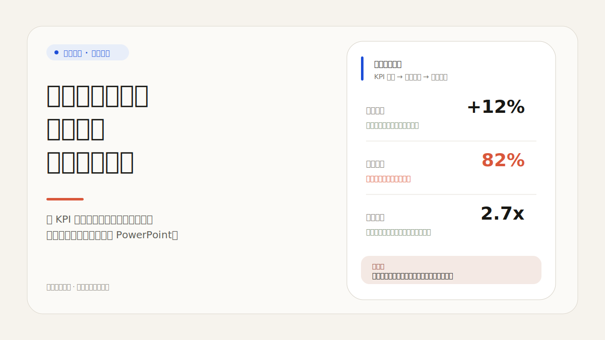
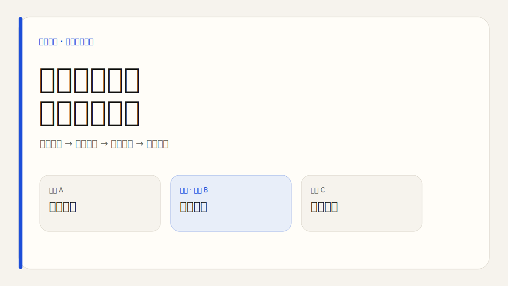
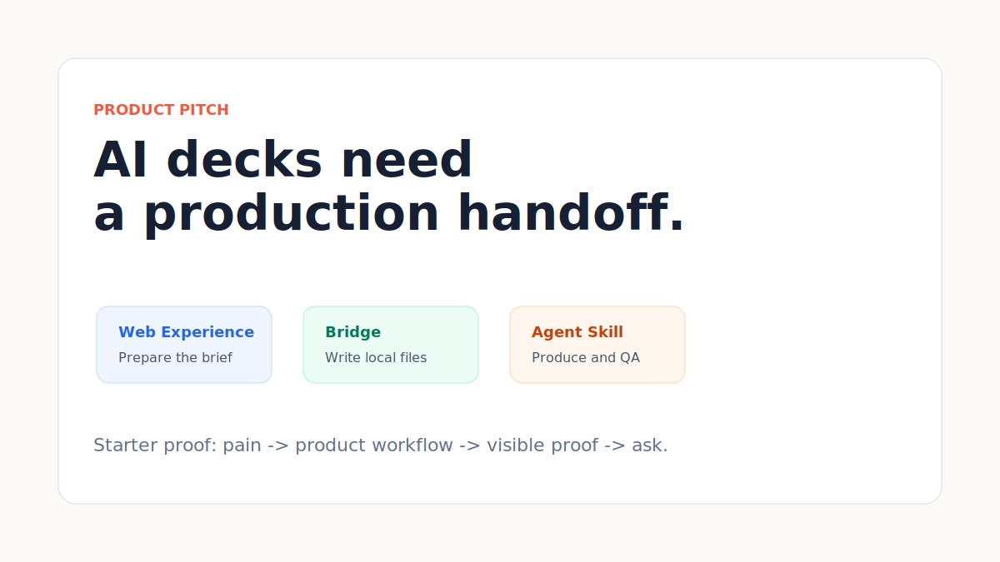

# Ultimate PPT Master - v5.4.1

本地优先的 AI 演示文稿生产系统。你可以给一句自然语言、笔记、文件或 URL；Agent 会先写 `bestEffectBrief`，再选择可编辑 PPTX、Style A Editorial Fixed Rhythm 网页 Deck，或 Style B 瑞士国际主义网页 Deck，并留下来源、图片和质量记录。

<p align="center">
  <strong>v5.4.1</strong> · <a href="./README.md">English README</a> · 中文 · <a href="./docs/zh-CN">中文文档</a> · <a href="./docs/zh-CN/release/release-notes-v5.4.1.md">v5.4.1 发布说明</a> · <a href="./docs/guides/agent-setup.md">Agent Skill</a>
</p>


<p align="center">
  <a href="https://kdnsna.github.io/ultimate-ppt-master-skill/"><strong>打开 Web Experience</strong></a>
  ·
  <a href="https://kdnsna.github.io/ultimate-ppt-master-skill/benchmark/"><strong>Proof Packs</strong></a>
  ·
  <a href="./docs/zh-CN/release/release-notes-v5.4.1.md"><strong>v5.4.1 说明</strong></a>
  ·
  <a href="./docs/guides/agent-connect-bridge.md"><strong>Agent Bridge</strong></a>
</p>

## 真实 Proof Packs

公开案例页保留 `/benchmark/` 兼容路径，但展示名称改为 Proof Packs：input -> preset -> output -> review。分数是 Design Doctor 自评，并链接评分口径，不再伪装成外部对比测试。

| Proof pack | 稀薄输入信号 | 输出 |
|---|---|---|
| Executive Business Review | 159 词脱敏材料，首行 "Executive Business Review Starter Source" | [web-demo](https://kdnsna.github.io/ultimate-ppt-master-skill/examples/executive-business-review-starter/web-demo.html) |
| Consulting Proposal | 120 词脱敏材料，首行 "Consulting Proposal Starter Source" | [web-demo](https://kdnsna.github.io/ultimate-ppt-master-skill/examples/consulting-proposal-starter/web-demo.html) |
| Product Pitch | 127 词脱敏材料，首行 "Product Pitch Starter Source" | [web-demo](https://kdnsna.github.io/ultimate-ppt-master-skill/examples/product-pitch-starter/web-demo.html) |
| Tech Trend Web Deck | 128 词脱敏材料，首行 "Tech Trend Web Deck Starter Source" | [web-demo](https://kdnsna.github.io/ultimate-ppt-master-skill/examples/tech-trend-web-deck-starter/web-demo.html) |





## 路线选择

| 需求 | 路线 | 输出 |
|---|---|---|
| 正式汇报、咨询方案、培训材料、政务/金融材料，或明确要可编辑文件 | 可编辑 PPTX | 可在 PowerPoint 继续改的文字、形状、图表、表格、备注和质量检查。 |
| 只有主题或极短指令，且没有正式/可编辑信号 | Style A Editorial Fixed Rhythm | 稳定 8 页电子杂志 × 电子墨水 HTML Deck，并先生成自动扩写 brief。 |
| 数据、KPI、网格、方法论、产品分析、Helvetica 或信息设计信号 | Style B 瑞士国际主义 | 锁定 Sxx 版式的 Web Deck，并通过 `npm run audit:swiss-deck`。 |
| 同时需要浏览器展示和正式交付 | 双交付 | Web 与 PPTX 分项目生成，共用来源和路线记录。 |

用户不需要特殊咒语。自然语言即可；最佳效果提示增强器会在生产前扩写极短指令。

## 能做什么

| 工作 | 系统怎样处理 |
|---|---|
| 领导汇报 | 先澄清受众、来源可信度、责任动作和决策诉求，再生产 PPTX。 |
| 咨询方案 | 把诊断、选项、建议和路线图整理成可编辑商务 deck。 |
| 培训材料 | 保持结构、案例、练习和讲者备注可编辑，方便后续授课。 |
| 产品或 KPI 叙事 | 当网格、指标、方法、对比或证据密度更重要时走 Style B。 |
| 公开演讲或 demo day | 当视觉节奏比 PowerPoint 编辑更重要时走 Web Deck。 |
| 一句话想法 | 先扩写 `bestEffectBrief`，再确定路线、风格、假设和风险说明。 |
| 品牌或 IP 密集材料 | 要求官方/用户提供素材；无法授权时阻塞对外发布。 |

## 产品闭环

```text
request or source
  -> Best-Effect Brief Enhancer
  -> route decision
  -> project-brief.json
  -> source and asset planning
  -> page roles and storyboard
  -> generated no-text visuals when useful
  -> PPTX or Web Deck assembly
  -> rendered review
  -> quality report and safe repair plan
```

## 交付保证

| 保证 | 检查哪里 |
|---|---|
| brief 不是用户原句 | `project-brief.json.bestEffectBrief` |
| 生图不是历史复用 | `asset_plan.json.items[].current_generation_evidence` |
| 手动图片缺口可见 | `Needs-Manual` 行和预期文件名 |
| 导出绑定当前检查 | `pipeline-state.json` digest 和质量结果 |
| 公开 proof 可审查 | proof source、web demo 和 `quality-report.json` |

## 60 秒开箱即用

```bash
git clone https://github.com/kdnsna/ultimate-ppt-master-skill.git
cd ultimate-ppt-master-skill
npm run setup
npm run doctor
npm run bridge
```

然后打开 [Web Experience](https://kdnsna.github.io/ultimate-ppt-master-skill/)。Bridge 写入本地 handoff 文件；Agent Skill 仍然是生产引擎。

Agent 调用示例：

```text
Use $ultimate-ppt-master with any natural-language presentation request. It will expand the request into a best-effect brief, choose PPTX or Web Deck, and run the matching quality checks.
```

## 依赖与降级

| 依赖 | 用途 | 缺失时 |
|---|---|---|
| Python 3.10+ | 来源转换、审计、PPTX/SVG 工作流 | `npm run doctor` 标为关键问题。 |
| Node.js 18+ 和 npm | Web Experience、Bridge、Node 测试 | Web/Bridge 命令不可用。 |
| `.venv` Python 包 | `python-pptx`、来源工具、审计 | `npm run setup` 安装；doctor 会指出缺失模块。 |
| `~/.ppt-master/.env` 里的 provider key | LLM 和生图 | 无生图 key 时写出 `Needs-Manual` prompts，不让整套 deck 失败。 |
| `curl_cffi` | 微信或高安全网页抓取 | 能回退到 Node/plain requests 的路径会继续尝试。 |
| Rust/Cargo | 原生桌面打包 | Web Experience 和 Bridge 仍可工作。 |

`npm run doctor` 是第一条排障命令。它会说明缺了什么，以及缺失项是关键阻断还是只影响某个 provider 路径。

## 能力

| 能力 | 可执行合同 |
|---|---|
| 最佳效果提示增强器 | `project-brief.json` 记录 `bestEffectBrief`、提示质量、路线、假设和 caveat。 |
| 资产工厂 | 先生成 `asset_plan.json`，再生成 `image_prompts.json`；Generated 行必须有 `current_generation_evidence`。 |
| 图片证据 | `scripts/image_gen.py --asset-plan` 写入 run id、backend、prompt hash、file hash、宽高和时间戳。 |
| 图片审计 | `npm run audit:image-contracts` 拒绝过期或缺失的生成证据。 |
| 瑞士风网页 Deck | `examples/swiss-v54-demo/index.html` 由 `npm run audit:swiss-deck` 检查。 |
| Style A 网页 Deck | `examples/magazine-v54-demo/index.html` 由 `npm run audit:magazine-deck` 检查。 |
| 质量证明 | `pipeline-state.json` 在 PPTX 导出前记录最新质量通过状态。 |
| 审阅闭环 | 渲染审阅先写 findings；修复仍然显式、报告优先。 |

## 核心产物

- `project-brief.json`：生产 brief，包含 `bestEffectBrief`、`visualBrief`、`guidedBrief` 和 `expectationFit`。
- `asset_plan.json`：图片父计划，记录 slot、来源策略、prompt 路径、状态和证据要求。
- `images/image_prompts.json`：从资产计划派生的生成项 prompt manifest。
- `source-map.json`：deck 使用的来源主张。
- `storyboard.json`：页面角色、配方、证据引用和可编辑目标。
- `spec_lock.md`：紧凑执行锁；长 deck 用分页切片，不读膨胀长文件。
- `quality-report.json`：交付、规划、期望和渲染审阅状态。
- `pipeline-state.json`：导出安全所需的当前质量门禁 digest。

## 已知限制

- 生成图片不应含中文正文；标签和标题应放在可编辑/矢量层。
- 超过约 16 页建议规划后分段续跑，不做一次超长连续执行。
- `Needs-Manual` 图片行必须补齐文件，或在页面组装前替换成明确标注的占位框。
- 官方 Logo、二维码、卡面、活动 IP 无法安全获取时，对外发布会被阻塞，直到提供授权替代。
- Style A 有结构化杂志验证；Style B 有更严格的瑞士版式签名和图片槽检查。
- Hosted Web Experience 负责准备和导出 handoff 项目；生产级 deck 生成仍由 Agent/Skill 牵引。

## Capability Matrix

| 层级 | 证明 |
|---|---|
| v5.4 瑞士风 Deck 与资产工厂 | [发布说明 - v5.4.1](./docs/zh-CN/release/release-notes-v5.4.1.md) |
| v5.3 最佳效果提示增强器 | [发布说明 - v5.3.0](./docs/zh-CN/release/release-notes-v5.3.0.md) |
| v5.2 期望匹配合同 | [发布说明 - v5.2.0](./docs/zh-CN/release/release-notes-v5.2.0.md) |
| v5.1 分步需求访谈 | [发布说明 - v5.1.0](./docs/zh-CN/release/release-notes-v5.1.0.md) |
| v5.0 交付默认值 | [发布说明 - v5.0.0](./docs/zh-CN/release/release-notes-v5.0.0.md) |
| v4.3 渲染审阅闭环 | [v4.3 渲染审阅闭环](./docs/zh-CN/quality/rendered-review-loop-v4.3.md) |
| v4.2 DeckIR AI 策划工作流 | [v4.2 DeckIR AI 策划工作流](./docs/zh-CN/quality/deckir-ai-planning-workflow-v4.2.md) |
| v4.1 精简网页控制台 | [发布说明 - v4.1.0](./docs/zh-CN/release/release-notes-v4.1.0.md) |
| v4.0 混合可编辑视觉工作流 | [v4.0 混合可编辑视觉工作流](./docs/zh-CN/quality/hybrid-editable-visual-workflow-v4.0.md) |
| Quality Workbench v2.5 | [Quality Workbench v2.5](./docs/zh-CN/quality/quality-workbench-v2.5.md) |

## 文档地图

| 需求 | 阅读 |
|---|---|
| 使用 Web Experience | [Web Experience](./docs/zh-CN/guides/web-experience.md) |
| 连接本地文件和 Agent | [Agent Connect Bridge](./docs/zh-CN/guides/agent-connect-bridge.md) |
| 安装 Skill | [Agent Setup](./docs/guides/agent-setup.md) |
| 选择 PPTX、Web Deck 或 Desktop | [Choosing a Workflow](./docs/guides/choosing-a-workflow.md) |
| 配置本地 provider | [Model and Provider Setup](./docs/guides/model-provider-setup.md) |
| 查看发布维护 | [Release and Maintenance](./docs/release/release-maintenance.md) |
| 排查安装问题 | [Troubleshooting](./docs/guides/troubleshooting.md) |
| 浏览全部文档 | [中文文档索引](./docs/zh-CN/README.md) |

## 致谢

Guizang v1.1.0 启发了固定编辑节奏和瑞士风验证预期。Baoyu Skills v2.5.2 启发了生成证据链。这个 MIT 仓库保留自己的实现，并把上游复核写进维护文档，而不是把上游项目名作为公开功能名。

README 的承诺必须绑定可执行检查：这里的公开能力需要有脚本、测试、审计、公开 proof pack 或 release note 支撑。
