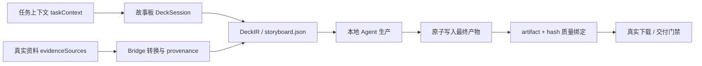

# v6.3.2–v6.3.6 设计说明

## 1. 设计判断

本轮不增加产品体量，重点提高默认下限。设计参考来自两类公开方法，但实现完全保持本项目自有代码：

- `gzh-design-skill`：大面积浅底与灰阶承重、品牌色只做少量锚点、主题变量与组件配方、源头 lint + 产物校验。该项目采用 AGPL-3.0 且明确不用于网页/PPT，因此只借鉴方法，不复制代码、HTML 或组件。
- PPT Master：先锁定设计参数，再按页面节奏与配方生成；每页有唯一视觉主角；生成后经过确定性检查和最终导出。

用户补充意见被提升为默认合同：墨黑不是首页或封面的主表面，硬直角不是普通组件的默认形态。

## 2. 视觉系统：Warm Paper UI

### 2.1 色彩角色

| 角色 | 色值 | 用途 |
|---|---:|---|
| 页面暖纸 | `#F6F3ED` | 页面背景、安静区 |
| 主表面 | `#FFFDF8` / `#FFFFFF` | 工作台、案例主卡、证据面板 |
| 文字墨色 | `#171714` | 标题、正文、细规则；不做默认大面积背景 |
| 次级文字 | `#676963` | 注释、状态说明、来源 |
| 证据蓝 | `#1D4ED8` | 主操作、焦点、证据锚点 |
| 信号橙 | `#D9573B` | 风险、重点提示，限制使用 |
| 辅助绿 | `#73866C` | 通过、稳定、支持信息 |
| 细边界 | `#DED9CF` | 轻量分组，不制造网格牢笼 |

色彩预算：中性表面与灰阶约占 90%；蓝/橙/绿只出现在状态、主操作、焦点和一条关键证据上。

### 2.2 圆角与深度

| 元素 | 圆角 | 深度 |
|---|---:|---|
| 页面/案例主卡 | 24px | 轻边框 + 极轻纸张阴影 |
| 任务阶段与证据面板 | 18–20px | 轻边框，避免多层阴影 |
| 输入、按钮、次级卡片 | 12–14px | 无阴影或仅 hover 阴影 |
| 状态标签 | 999px | 无阴影 |
| 图表、表格、证据规则线 | 0–6px | 精确直线优先 |

禁止用圆角把所有内容都包成卡片；圆角用于软化必要容器，内容层级仍依靠留白和排版。

### 2.3 首页与演示封面

- 工作台首屏：暖纸背景、白色主表面、左侧价值与任务入口、右侧单一准备度/证据面板。
- 主按钮：证据蓝，不再以墨黑填充作为默认 CTA。
- 正式办公封面：浅色背景 + 一个 24–32px 大圆角证据面板。
- 产品/品牌封面：默认浅色产品舞台；只有用户明确选中 cinematic dark 或真实素材要求时才使用深色。
- 案例库：两个主案例维持不等宽编辑式布局，但减少黑色粗边界，改用纸张色差、圆角主卡和细线。

## 3. 信息与状态架构



任务描述能指导结构，但不能自动升级为事实证据。URL 在 Bridge 转换成功前只是一条待处理输入。

## 4. Bridge 安全设计

### 4.1 请求边界

- 在路由进入副作用前统一执行 `assertAllowedOrigin(request)`。
- JSON POST 统一执行 `assertJsonContentType(request)`。
- 保留无 `Origin` 的本地 CLI 请求；浏览器请求必须匹配 localhost/127.0.0.1/允许的 Pages origin。
- 大请求返回结构化 `413`，不主动销毁连接。

### 4.2 路径边界

提供单一 `resolveSafeProjectPath(projectPath, relativePath, policy)`：

- 只接受 `/` 分隔的相对路径。
- 拒绝绝对路径、反斜杠、空段、`.`、`..` 和 NUL。
- `resolve()` 后必须位于项目根目录内。
- 写入目标的所有已有父级必须拒绝外部符号链接。
- prompt 仅允许 `prompts/*.md`，附件仅允许 `attachments/`，产物读取继续使用白名单。

### 4.3 项目与会话身份

- 项目目录：可读 slug + ISO 时间 + `randomUUID` 短段，或直接 `mkdtemp`。
- Handoff 请求携带 `sessionId`；manifest 记录该值。
- SSE 使用 `?sessionId=` 订阅并只发送匹配事件；Web 仍做二次过滤。
- Agent 启动建立项目级 job 状态与幂等锁。

## 5. Web 状态设计

### 5.1 Source 模型

```ts
type SourceState = {
  id: string;
  kind: "file" | "pptx" | "url";
  name: string;
  size?: number;
  url?: string;
  recoverability: "resident" | "url" | "needs-reselect";
  ingestion: "pending" | "converted" | "failed";
};
```

本地文件正文只驻留本次浏览器会话；持久化时只保存元数据，并在刷新后变为 `needs-reselect`。URL 可恢复，但必须重新由 Bridge 证明转换状态。

`DeckSession` 使用 `sessionStorage` 按标签页持久化：同一标签页刷新可恢复 `sessionId/projectPath`，其他标签页不会接收它的后续写入。旧版同名 `localStorage` 键只迁移到当前标签页一次，迁移后立即删除，防止新标签页继承旧项目路径。

### 5.2 产物模型

`canDeliver` 必须同时满足：

1. `allSlidesApproved === true`；
2. 至少一个最终成品 kind 为 `pptx | web-deck | pdf | archive`；
3. 该成品 `verification === passed`；
4. 质量报告绑定该成品的 `relativePath + sha256`。

### 5.3 可访问性

- Radio 使用 roving tabindex 与方向键导航。
- Dialog 使用焦点陷阱、初始焦点和返回焦点。
- 阶段切换依据 reduced-motion 决定 smooth/auto。
- 轮询采用 AbortController + request sequence；页面隐藏和 delivered 状态不轮询。

## 6. 版本切片

### v6.3.2 · 视觉纠偏与安全地基

- Warm Paper UI、浅色默认封面、圆角尺度和蓝色主操作。
- Origin/Content-Type 硬拒绝、项目内安全路径解析、干净 413。
- Desktop clippy 与 Node module warning 收口。

### v6.3.3 · 资料与证据真实性

- taskContext/evidenceSources 分离。
- URL 进入 Bridge 转换；无资料生产阻断。
- source id、数量/体积限制、同名附件与刷新恢复。

### v6.3.4 · 会话与交付真实性

- SSE session 隔离、唯一项目目录、Agent 启动幂等。
- artifact 类型门禁、原子产物、质量报告绑定摘要。

### v6.3.5 · 精修与运行可靠性

- 单页修订成员校验与历史。
- 单飞轮询、错误回显、键盘 radio、dialog 焦点与 reduced motion。
- Classic BASE_URL 与 Desktop 合同兼容。

### v6.3.6 · 验证与 GitHub 发布

- 1440/390 浏览器回归、双标签页、攻击矩阵和并发矩阵。
- 版本、README、案例库、Proof、发布说明和 CI 一致性。
- Web 主包小于 80KB gzip；所有构建、测试与审计通过。

## 7. 测试设计

### 合同

- 4/10/24 页与 P02 修改逐字段一致。
- 52+ Best-Effect fixtures 比较全部路由字段。
- 无资料、URL pending、刷新后需重选文件均不得 grounded。

### 安全

- 非法 Origin、错误 Content-Type、path traversal、反斜杠、符号链接、伪造 manifest。
- 120 个并发同标题、同名附件、超限附件和干净 413。
- outputDir 外 launch、未知 slideId/variant、重复 launch。

### 浏览器

- 1440/390、键盘 radio、对话框焦点、reduced motion。
- 双标签页 SSE 隔离、隐藏页暂停、刷新恢复、轮询竞态。
- 六种 Bridge/Agent/产物状态唯一主操作。
- 可执行入口：`npm run test:web-browser`；通过本机 Chrome DevTools Protocol 驱动真实页面，不使用源码字符串匹配代替交互验收。

### 视觉

- 工作台、案例库和自动封面不得存在默认满版墨黑主表面。
- 容器圆角 token 截图回归；图表/表格规则线不被强制圆角化。
- 中文无截断、错误标点和不可读对比度。

## 8. 兼容与迁移

- 保留 `deck-session-v6` 与 `DeckIR 1.0` 字段；新增字段均为向后兼容。
- 旧 session 缺少 source recoverability 时按 `needs-reselect` 迁移，不能假定文件仍可用。
- 旧 handoff 缺少 sessionId 时可列出历史产物，但不能接收新 SSE 或自动 launch。
- Classic 保留 `?classic=1` 至 v6.4，不在主导航展示。
