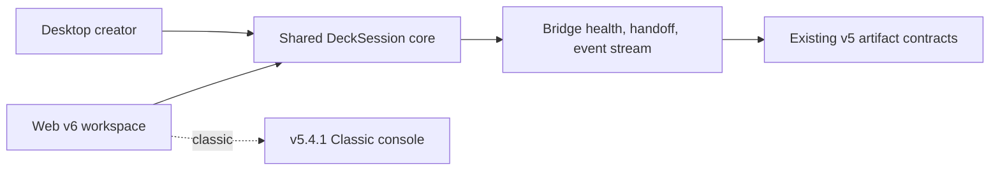

# Ultimate PPT Master v6 Workspace Design

## Architecture

- `packages/workspace-core/src/index.ts` owns phases, stable slide ids, visual directions, readiness, and progress-event types.
- `apps/web/src/V6Workspace.tsx` owns the default task-first experience; the existing `App.tsx` remains Classic mode.
- Desktop imports the same phase/direction labels and aligns its creator copy and progress language with the shared model.
- Bridge keeps current endpoints and adds a localhost-only SSE `/events` stream. Handoff writes `slideId` alongside existing `page` values.

## Experience

1. **Intake** — request, sources, output purpose, compact environment status.
2. **Outline** — editable stable-id slide map, evidence state, up to three questions.
3. **Generating** — three visual directions, deterministic draft preview, progress stream.
4. **Review / Delivered** — filmstrip, preview, findings, page-level revision intent, PowerPoint/PPTX/Web delivery actions.

Classic mode is selected with `?classic=1`; the default route is v6.

## Design Specification

- Purpose: local-first Chinese office presentation production with trustworthy handoff and local refinement.
- Direction: industrial/utilitarian with restrained editorial asymmetry.
- Palette: `#172033`, `#FFFFFF`, `#F3F5F7`, `#EF5B3F`, `#10B981`; `#2563EB` is information/focus only.
- Typography: `PingFang SC` for Chinese UI, `Avenir Next` for English/numeric display, optional `Inter` Web fallback by explicit product requirement, `Microsoft YaHei` for PPTX output.
- Layout: 7:5 intake split; review uses filmstrip/canvas/inspector. Mobile uses a compact top phase rail and single-column active content.

## Compatibility

- Existing handoff payload fields remain unchanged.
- `DeckSession` is additive and serialized under `projectBrief.deckSession`.
- Slides retain `page: P01`; `slideId: P01` is an additive stable alias.
- The v6 Web app may create a minimal compliant payload and rely on Bridge defaults for the full v5.2/v5.4 quality contract.

## Performance

- Classic is lazy-loaded and excluded from the default entry chunk.
- Only the active v6 phase is mounted.
- The Web Deck iframe is created only in review/delivered phases.
- Derived draft HTML is deferred; Bridge polling pauses when the document is hidden and SSE is preferred.

## Testing

- Unit tests for phase/readiness/stable-id behavior.
- Bridge tests for SSE and additive `slideId` compatibility.
- Static audit updated to check the default v6 entry, Classic escape hatch, semantics, and responsive rules.
- Browser smoke checks at desktop and mobile widths, plus screenshots of intake, outline, and review.
